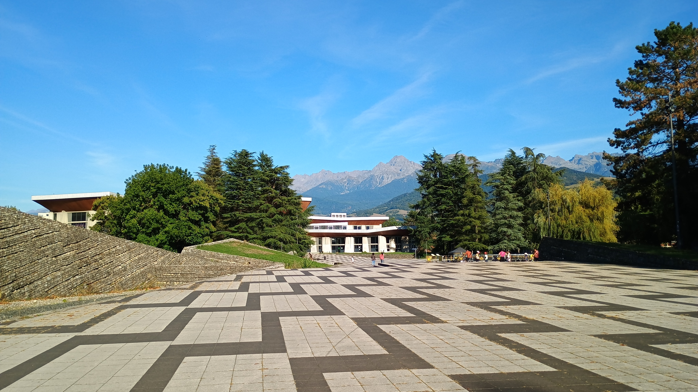
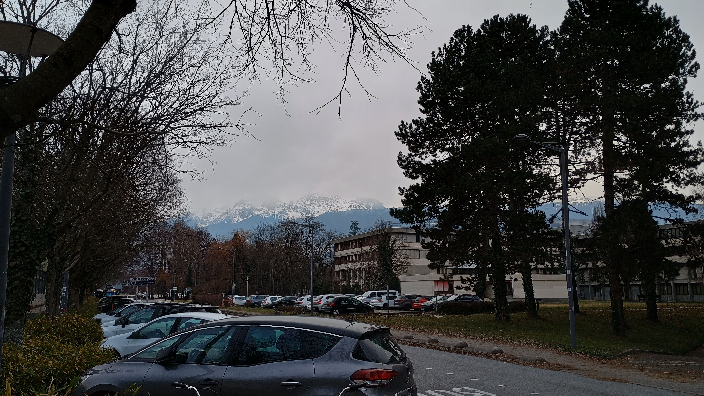
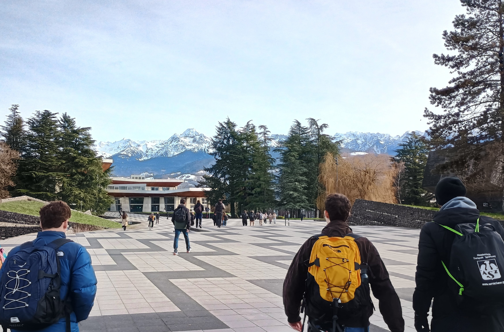
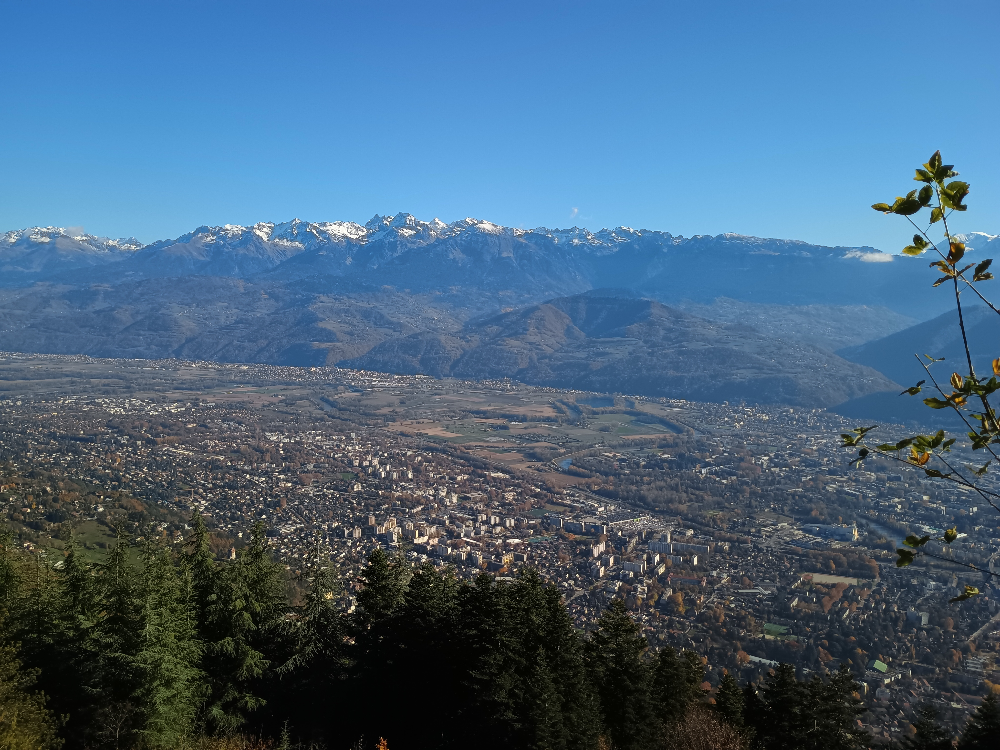
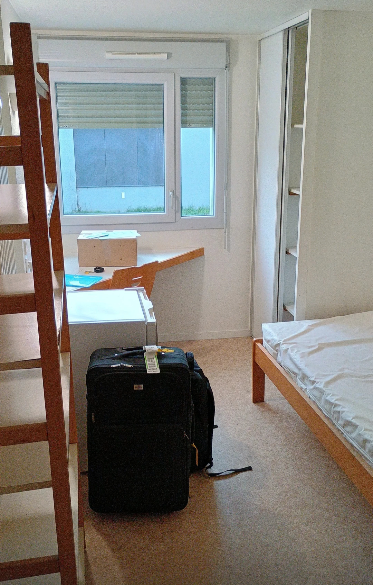
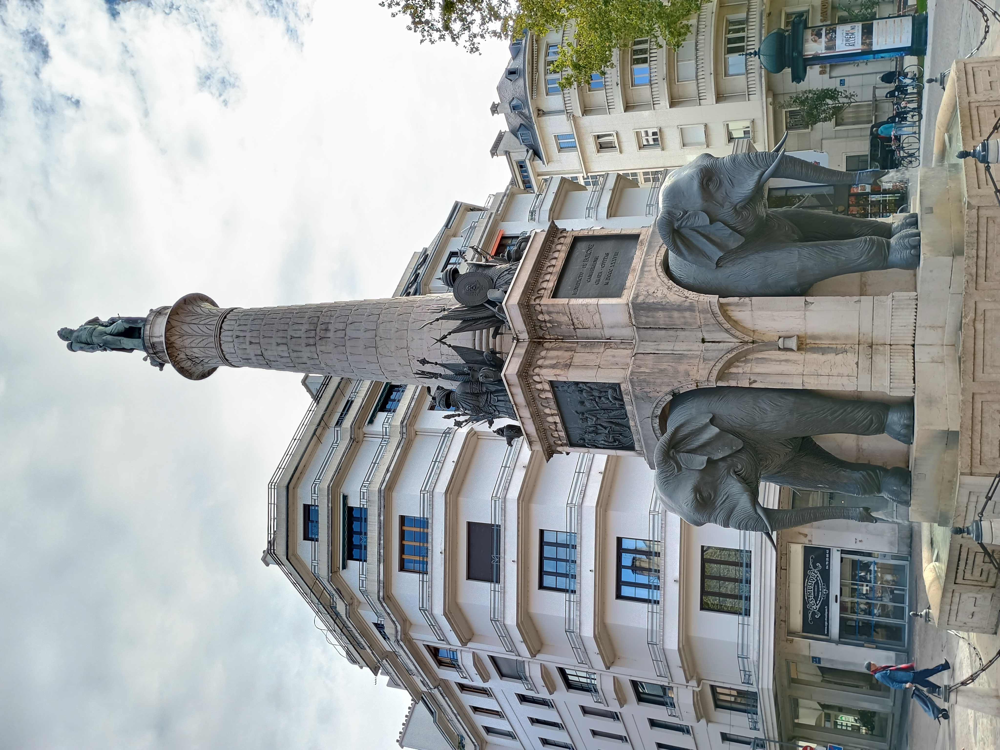
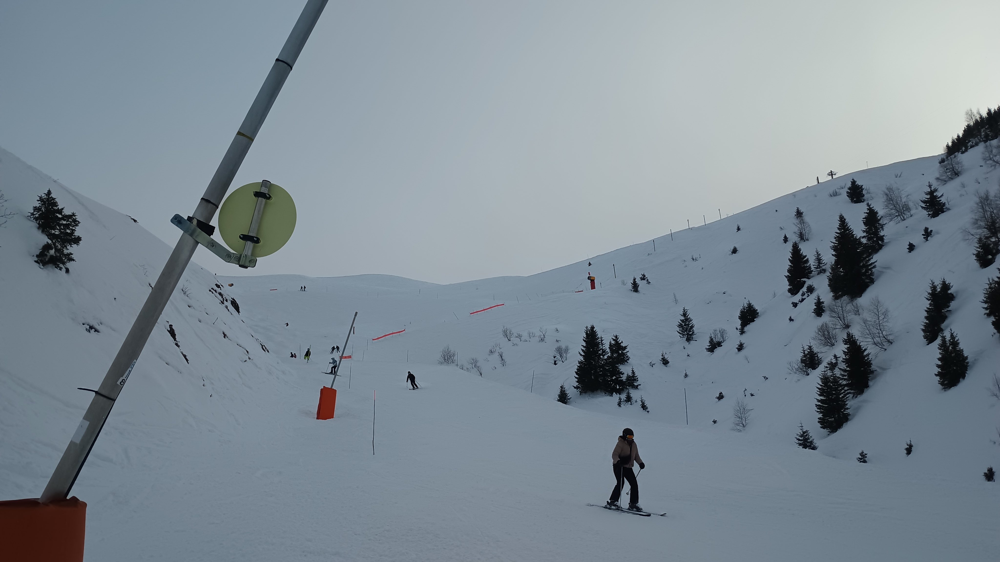

# Zpráva ze studijního pobytu Erasmus+ v Grenoblu

[zpráva je dostupná také v databázi mobility na webu Charles Abroad](https://www.charlesabroad.cz/damo-katalog/39817a9f-c94b-47dc-95b4-6d76f5ee3b6b)

- autor: [Vít Kološ](/)
- obor studia: Informatika – Umělá inteligence (1. ročník navazujícího magisterského studia) na Matematicko-fyzikální fakultě Univerzity Karlovy
- rok výjezdu: 2025/2026
- hostitelská instituce: Université Grenoble Alpes (UFR IM²AG), nepřímo také Grenoble INP / ENSIMAG

## Obecně o univerzitě

**Co Tě první napadne, když pomyslíš na svou „adoptivní“ univerzitu? Čím byla výjimečná? Jak vypadaly prostory ve kterých jsi studoval a jejich vybavení?**

Université Grenoble Alpes má rozsáhlý kampus v obci Saint-Martin-d'Hères, kterou však nepozorný návštěvník snadno může považovat za pouhou východní část Grenoblu. V tomto univerzitním areálu jsem měl veškerou výuku, byl jsem tam ubytován na koleji, nacházejí se tam menzy, knihovny, půjčovna kol… Zkrátka vše, co člověk ke studiu může potřebovat.

Jelikož jsem si zapsal předměty ze studijního programu, který UGA sdílí se školou ENSIMAG, většina výuky probíhala v budovách této instituce, jež jsou rovněž součástí kampusu. Ač byla jedna z budov nová či nově zrekonstruovaná, celkově bych technický stav poslucháren a přidružených prostor označil za podprůměrný.

## Studium a přístup ke studentům

**Liší se způsob studia na zahraničí univerzitě? Lišil se v něčem přístup učitelů a administrativy ke studentům?**

Jistým specifikem bylo, že všechny zkoušky byly písemné a měly pevný termín – „zkouškové období“ trvalo týden a půl. Bylo však poměrně obvyklé, že jsme si ke zkoušce mohli přinést jakýsi tahák. Jinak se studium velmi blížilo tomu, na co jsem zvyklý z Česka.

Příjemně mě překvapila administrativní flexibilita, jíž se mi dostalo v souvislosti s náplní mého výjezdu: Smlouvu s MFF UK totiž uzavřela katedra fyziky (UFR PhITEM), ale bylo možné, aby mě přijala katedra informatiky (UFR IM²AG) a abych jakožto student 1. ročníku navazujícího magisterského studia studoval předměty určené pro 2. ročník (M2).

## Život na univerzitě

**Jak vypadá život na univerzitě? Fungují zde nějaké studentské spolky? Jsou k dispozici volitelné předměty, které přibližují jazyk a kulturu dané země? Pořádá univerzita pro své studenty volnočasové aktivity?**

Zúčastnil jsem se některých akcí organizovaných studentským spolkem IntEGre a organizací CROUS. Zejména bych chtěl doporučit mezinárodní karaoke (IntEGre) a latinskoamerické tance (CROUS). Velmi hodnotný byl pro mě také večerní kurz francouzštiny. který jsem absolvoval přímo na univerzitě a byl součástí mého Learning Agreementu.

## Jazykové nároky

**Komunikoval jsi v angličtině, nebo v jazyce hostitelské země? Jaké požadavky jsou v oblasti jazyka kladeny univerzitou?**

Studoval jsem v angličtině a rovněž veškeré studijní záležitosti jsem se primárně snažil řešit anglicky. V průběhu semestru nastaly některé situace, kdy se mi znalost francouzštiny vyplatila, ale znám spolužáky, kteří se studiu francouzštiny věnovali jen okrajově, a během svého pobytu zvládli vykomunikovat vše potřebné.

Oficiálním požadavkem byla úroveň B2 v angličtině, respektive B1 ve francouzštině, kdybych měl francouzské předměty. To bylo možné prokázat certifikátem nebo i pouhým prohlášením koordinátora či vyučujícího.

## Město

**Jak na tebe město působilo? Jak bys jej charakterizoval? Co je zde zajímavého k vidění? Jaká byla tvoje oblíbená místa?**

Prostředí univerzitního kampusu je velmi klidné a pohodové, i když kampus na jihu sousedí s průmyslovou zónou, kterou zakončuje rušná výpadovka. Snadno se však dá dostat do příjemnějších částí města. K dopravě po městě se dá skvěle využít kolo – jednak je k tomu uzpůsobena dopravní infrastruktura a jednak městská firma Mvélo+ nabízí dlouhodobý pronájem kol za dotované ceny. Při výrazné nepřízni počasí lze samozřejmě využít také tramvají a autobusů. Z kampusu do centra je to na kole asi 15 minut.

Nad městem se tyčí pevnost Bastille, kam sice jezdí lanovka, ale nejen studentům informatiky jistě prospěje pěší výstup, který se dá prodloužit na Mont Jalla nebo ještě výš na Mont Rachais – byť to už bych nepovažoval za pohodovou odpolední vycházku, nýbrž za turistiku se vším všudy.

## Stipendium

**Jak lze podle Tvojí zkušenosti vyjít ve městě se stipendiem? Kolik procent výdajů Ti pokrylo? Jaký je Tvůj názor na ceny v zemi obecně?**

Stipendium mi vyšlo v podstatě přesně, tzn. pokrylo mi snad všechny výdaje a nic z něj nezbylo. Je potřeba dodat, že jsem bydlel na koleji CROUS a že jsem čerpal příspěvek CAF. Zároveň jsem se ale nesnažil za každou cenu šetřit. Francouzské ceny jsou v podstatě srovnatelné s těmi českými, byť průměrná cenová hladina může být trochu vyšší.

**Poraď prosím spolužákům, jak ušetřit. Jaké služby lze v rámci úspory financí využívat?**

Doporučuji požádat o příspěvek na bydlení, který poskytuje CAF. K žádosti jsem doložil rodný list s vícejazyčným/francouzským standardním formulářem. Dále se vyplatí využít služeb CROUS, tedy bydlet na koleji a stravovat se v menze. Díky ježdění na kole jsem ušetřil za MHD. Při delších cestách je výhodné využívat autobusy, které jsou výrazně levnější než vlaková doprava, byť můžou být méně spolehlivé.

## Ubytování

**Jaké ubytování sis zvolil? Doporučil bys jej ostatním? A pokud ne, jaká varianta ubytování je podle Tvých zkušeností nejlepší?**

S kolejí CROUS jsem byl spokojen, byť to mělo oproti Česku některá specifika. Třeba jsem si musel pořídit vlastní peřinu, jelikož nebyla součástí uvítacího balíčku. Také mě překvapilo, že v kuchyňce nebyla trouba ani mikrovlnka nebo že se na podzim a v zimě vytápělo na nižší teplotu, než na jakou jsem zvyklý z českých kolejí. Bylo však příjemné, že jsem měl na jednolůžkovém pokoji k dispozici vlastní koupelnu.

## Jazyk a kultura

**Jakých kulturních odlišností sis všiml? Jak ses vypořádával s národním jazykem? Byl to i jazyk Tvého studia? Máš pocit, že ses se v jazyce díky pobytu posunul?**

Překvapilo mě, že skoro v každém obchodě u pokladny nahlížejí do batohu a že se do bazénu chodí jedině v plavecké čepici. Také mě až trochu šokovalo, jak blízko mají někteří mladí Francouzi ke komunismu.

Studoval jsem anglický studijní program, tedy jsem se pohyboval v opravdu multikulturním prostředí, spolužáci byli z celého světa a francouzských studentů bylo minimum. Přesto se naskytly různé příležitosti trénovat francouzštinu, třeba na tanečních lekcích CROUS. Myslím, že se zlepšila zejména má schopnost porozumění rodilým mluvčím a také jsem se naučil lépe improvizovat.

## Doprava a cestování

**Využil jsi pobytu k cestování a objevování státu? Jaké jsou tvoje nejlepší cestovatelské zážitky? Co naopak nedoporučuješ?**

Na cestování jsem během svého pobytu nenašel moc času, ale můžu doporučit návštěvu Chambéry, tedy hlavního města Savojska.

## Individuální potřeby

**Nakolik byla přijímající univerzita vstřícná vůči tvým individuálním potřebám?**

Musím opravdu ocenit vstřícný přístup katedry informatiky (UFR IM²AG), jelikož jsem si mohl zapsat předměty z různých studijních programů. Zároveň mi byl umožněn již zmiňovaný přestup z evidence katedry fyziky pod katedru informatiky a také jsem si jakožto student prvního ročníku mohl zapsat předměty z M2.

**Co bys doporučil studentům se specifickými potřebami, kteří se rozhodnou vyjet na tuto univerzitu?**

Aby tyto potřeby komunikovali v dostatečném předstihu.

## Proč právě sem?

**V čem je univerzita a lokalita výjimečná? Proč bys své kamarády do „svého“ města a na tuto univerzitu poslal ty?**

Grenoble je v podstatě ze všech stran obklopen vysokými horami. Já nijak zásadně neholduju lyžování, lezení ani horské turistice, čímž jsem byl mezi svými spolužáky spíše výjimkou, ale přesto jsem si pobyt v tomto spíše poklidném a ne příliš turisty navštěvovaném městě moc užil. Bylo pro mě obohacující vyzkoušet, jaké to je, když se jízdní kolo stane hlavním dopravním prostředkem.

*Alpe d'Huez*
