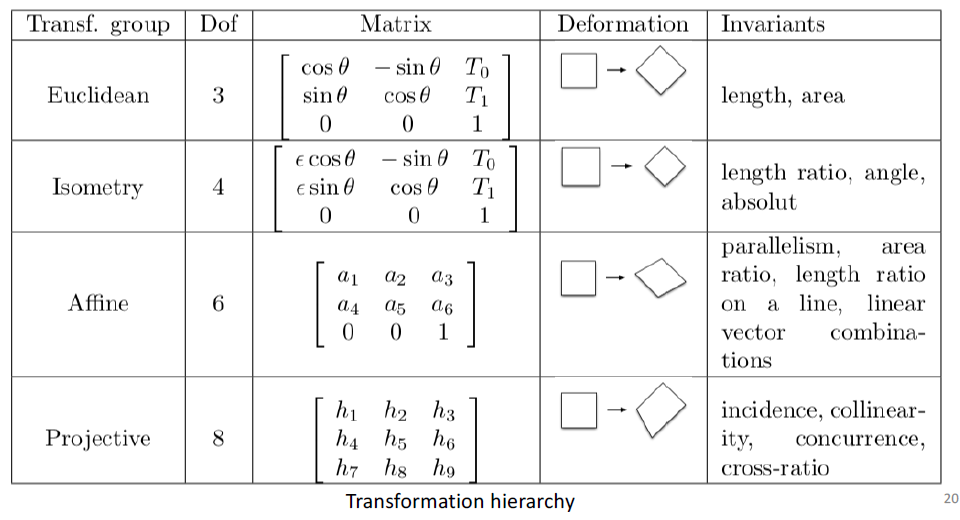

# Exam

- image processing vs. computer vision
	- processing: reasoning focused on the image, pixels, pixel groups
	- vision: focuses on the knowledge the image brings from a real scene
- difficult problem
	- the goal of computer vision is not to mimic human vision but to build systems that extract information
	- computer vision is an inverse of the synthesis problem
		- projection is fundamentally ambiguous – we are losing information (depth, size, occlusions)
		- in general it's an ill-posed problem: no unique solution for a given observation, ambiguous solutions, incomplete data (example: scale of the observed scene, toy car instead of normal car)
		- need of injecting a priori knowledge and regularization (example: penalize non-smooth solutions)
	- from noisy observations, we estimate the parameters of a model
	- a priori knowledge: physics, geometry, semantics
	- example: by counting visible wheels of the car, we can tell the position of the camera
	- desirable characteristics
		- robustness – be able to identify observation noise/errors (have plan B in case of error)
		- speed
		- precision
		- generality – the algorithm should be generic; the pool of situations that it can handle should be large enough
- main vision problems
	- calibration – where is the camera, which model, …
	- segmentation – which parts of the image belong together
	- detection – what is interesting/salient in the image
	- reconstruction – where are the objects (position, shape, 3D surface)
	- tracking – which motion is present in the image, how do objects move
	- recognition – what do we see, semantics
- image – 2D signal (depicts a 3D scene), matrix of values that represent a signal, has semantic information
- light
	- plays a fundamental role in 3D perception
	- no light → no image
	- shadow, diffuse reflection (in many directions), specular reflection (mirror-like, in one direction)
	- wavelength, spectrums
		- solar spectrum: almost continuous spectrum, some wavelengths are stronger
		- white light: continuous spectrum (energy evenly distributed)
		- sodium vapor lamp: only yellow → red car appears dark
	- what happens when a light ray hits the surface
		- absorption (black surface)
		- reflection, refraction (mirror, reflector)
		- diffusion (milk)
		- fluorescence
		- transmission and emission (human skin)
	- most surfaces can be approximated by simple models
	- first simplified hypothesis
		- no fluorescent surfaces
		- “cold” objects (they don't emit light)
		- all light emitted from a surface point is formed solely by the light arriving there
	- standard model: BRDF
		- bi-directional reflectance distribution function
		- models the ratio of energy for each wavelength $\lambda$
			- incoming from direction $\hat v_i$
			- emitted towards direction $\hat v_r$
		- reciprocity (we can swap the light source and the camera)
		- isotropy (no favorite direction) – does not always hold
		- energy corresponds to an integral (we can use a discrete sum)
		- Lambert assumption
			- diffuse surface: uniform in all directions (paper, milk, matt paint)
			- the BRDF is a constant function $f_d(\hat v_i,\hat v_r,\hat n,\lambda)=f_d(\lambda)$
		- specular (reflective) material, central lobe on $\hat s_i$
			- Phong … $f_s(\theta_s,\lambda)=k_s(\lambda)\cos ^{k_e}\theta_s$
			- Torrence-Sparrow
		- di-chromatic = diffuse + specular
- pipeline in a digital camera
	- to get RAW
		- optics → aperture → shutter → sensor → gain (ISO) → A/D
	- to get JPEG from RAW
		- demosaic → sharpen → white balance → gamma/curve → compress
- optical role: isolate the light rays (from one particular part of the scene)
- pinhole cameras
	- Rayleigh: ideal diameter $d=1.9\sqrt{f\lambda}$ ($f$ focal distance, $\lambda$ wavelength)
	- image distorted by the shape of the pinhole
- we can model a complicated system of lenses using just one lens
- perfect lens: hypothesis
	- a point in the scene corresponds to a point in an image
	- all image points are in the same plane
	- this is not true, there are artifacts
- chromatic artifacts (fringing)
	- diffraction – wavelength dependent
	- all colors are not focused to the same point
- vignetting … border of the image is darker
- geometric distortion (for wide-angle cameras)
- CCD sensor, CMOS sensor
- rolling shutter
	- lines of the sensor are discharged sequentially → moving objects can be distorted
	- usually in cheap CMOS
- color spaces
	- RGB … additive
	- CMY … subtractive
- color perception
	- retina (sítnice) – there is fovea
	- rods – achromatic perception of lights, pigmentation (rhodopsin) is sensitive to all visible spectrum (peak on green)
		- on peripheral retina
	- cones – color perception
		- on the fovea
	- mantis shrimp has the most complex visual system ever discovered
- color perception in a camera
	- deviation/dispersion prism
		- 3 CCD sensors
		- precise alignment, high quality filter
		- expensive
	- Bayer filter
		- individual (plastic) filter for each pixel (RGGB, RGCB)
		- to get colors in each pixel, we interpolate (integrate over spectrums)
- sensor artifacts
	- noise: salt and pepper, thermic noise (as the camera heats up)
	- aliasing (low-frequency artifacts emerge from high-frequency signal)
- gamma correction – adjusting brightness to match human perception
	- otherwise, most of the linear scale would be bright
- JPEG compression artifacts
- color models
	- RGB – additive model, mixing wavelengths
	- CMY – subtractive model, mixing pigments (“subtracting” wavelengths)
	- HSV or HSB – hue (“intrinsic color”), saturation, value
		- useful for artists
	- YUV, YIQ – 1 luma component + 2 chroma components
		- for TV broadcasting, luminance can be used for black & white TV
	- application: robotic detection
		- we can detect an object based on its color (ignoring luminance or value)

## Filters, Contours, Segmentation

- characterization of an image (what is interesting?)
	- salient (key) points – areas of strong contrast (0D)
	- lines, salient contours – contrast boundaries (1D)
	- regions – groups of pixels with similar properties (2D)
	- duality – contours & regions (between the contours)
- noise filtering
	- “how to distinguish between information and noise”
	- most simple and adopted model: Gaussian noise (thermal)
		- additive noise, independently sampled in each pixel from a Gaussian distribution
	- convolution with a low-band Gaussian filter – to remove the high frequencies (likely noise) and make derivative easier to compute
	- convolution
		- $(m*f)(x)=\int_u m(u)f(x-u)\,du$
		- $(m*f)(x,y)=\int_u\int_v m(u,v) f(x-u,y-v)\,du\,dv$
		- theorem: derivative of convolution = convolution of derivative
	- average over neighboring pixels … mean filter
		- but Gaussian filter works better – the neighboring pixels have less effect
- edge
	- some kind of discontinuity (surface, depth, color, illumination, …)
	- properties: contrast, orientation
	- descriptors: normal (unit vector, direction of maximal change), direction (perp. to normal), position, intensity
- detecting edges
	- first apply smoothing, then find color change (peak of first derivative or zero-crossing of second derivative)
	- edge notion is binary – we need a threshold
	- image is not a continuous function – we approximate it using Taylor expansion (just using a plane)
	- finite differences (used to approximate derivative)
	- gradient operator: Sobel
		- modern neural networks tend to learn this filter to process data :)
		- approximates horizontal ($\frac{\partial I}{\partial x}$) and vertical ($\frac{\partial I}{\partial y}$) gradients
		- it's a particular case of composition of $3×3$ Gaussian filter $\begin{pmatrix}1&2&1\\2&4&2\\1&2&1\end{pmatrix}$and finite differences
	- scaling of the filtering kernel influences the detected contours
	- another operator: Laplace $\begin{pmatrix}0&1&0\\1&-4&1\\0&1&0\end{pmatrix}$
	- Laplacian of Gaussian (LoG) … we apply Laplacian on the Gaussian and then convolute it with the image
		- reverse Mexican hat
	- contour extraction (Canny)
		- we only take one pixel with the highest value in the direction of the gradient
		- we still need to use a reasonable scale and threshold
- line detection – Hough transform
	- how to express a line
		- $ax+by+c=0$
		- or we can use polar coordinates: $(r,\theta)$
			- $r=x\cos\theta+y\sin\theta$
			- $r$ … distance from the origin
			- $\theta$ … slope (kind of)
			- we consider a line segment perpendicular to the line – $r$ is its length, $\theta$ is its slope
	- let's vote!
		- each observation adds one point to each line going through it – to the pair $(r,\theta)$
		- we have a restricted set of parameters → it works
- segmentation
	- Gestalt theory
	- region – group of pixels with similar properties
	- we need a similarity measure
		- distance to the mean of the region
		- Mahalanobis distance (distance weighted with the variance of the characteristics)
	- similarity in color space
		- clustering by aggregation × subdivision
		- k-means
		- Gaussian mixture models
			- probability of a point belonging to a cluster
			- probability to observe a point is a mixture of Gaussians
			- expectation maximization is used to solve it
				- E: knowing the current estimates of blobs, we compute the probabilities of the points belonging to them
				- M: we recompute the blob parameters to maximize likelihood
			- advantages: allows non-spherical clusters, can better handle outliers (we can add an outlier cluster)
			- problems: we still need to choose $k$; it is sensitive to initialization; the generative model (shape of the blobs) need to be chosen
	- superpixels
		- we need to group based on both color and spatial proximity
		- SLIC algorithm … k-means in 5D (color + 2D coordinates)
		- segmentation using a graph partitioning strategy
			- one pixel → one vertex
			- edges to other pixels
			- remove the edges of low similarity
				- based on distance, intensity, color, …
			- subgraphs represent different groups
			- algorithm Graph cut
			- high memory and computation requirements, biases in the cuts (regions with similar sizes are preferred)
	- Grabcut – interactive method (user selects and refines the segmentation)
	- Meta AI: Segment Anything Model (SAM)
		- trained using superpixels
	- deep clustering
		- they trained encoder and decoder
		- k-means in the latent (embedding) space
	- Dino (segmentation emerges from self-supervised learning)

## Interest Points

- motivation: 2D tracking (motion), find correspondances (in the 3D world), recognition
- segmentation is usually avoided (it is a source of errors – finding interest points is more robust)
- challenges: scale change, rotation, viewpoint change, change in appearance (lighting, colorimetry)
- usual pipeline: detect points, describe points, find correspondances
- desired properties of a detector
	- use *local* (not global) characteristics – more robust to occlusions
	- invariance to translation, rotation, scale, lightning
	- robust to noise, bad conditions, compression
	- discriminative – allow to identify objects
	- quantity – we need enough points
	- precision – accurate location of the object in the image
	- efficiency – fast computation
- Moravec's detector
	- small window (does shifting it lead to a change of intensity?)
	- if a shift of the window in any direction results in an intensity change, we have found a corner
- Harris detector – “differentiable Moravec”
	- Taylor expansion
	- bilinear form
	- eigenvalues
		- minimum eigenvalue – slowest change direction
		- maximum eigenvalue – fastest change direction
		- hard to compute → we use $R$ instead
			- $R=\det M-\alpha(\mathrm{trace}\ M)^2$
			- $R\gt 0\implies$ corner
			- $R\lt 0\implies$ contour
			- small $|R|\implies$ homogeneous region
	- algorithm
		- compute derivatives of the image (using Sobel…)
		- compute $R$ in each point
		- find points with a high $R$ (over certain threshold)
		- keep the local maxima of $R$
	- we don't want too many interest points, various strategies (keep top $k$ points per image; ensure that every $n$ pixels radius has its top interest point)
	- properties
		- rotation invariance
		- invariance to intensity shift, partial invariance to intensity scaling
		- no invariance to scale changes
			- we consider circular regions of different sizes on a point
			- but how to choose them?
- scale invariant detector
	- image pyramid (consider several smaller versions of the same image)
	- scale invariant function which serves as a basis for the detection algorithm – LoG, we can also use difference of Gaussians (DoG) which is similar (but more efficient to compute)
	- Harris-Laplacian detector – find the local max. of…
		1. Harris detector in image space (coordinates)
		2. LoG in the scale space
	- SIFT (Lowe) – find the local max. of DoG in image space *and* scale space
- how to match detected points?
	- we need descriptors – should be invariant and discriminant
		- Harris: use eigen values? not so discriminant
		- windowed approaches – not so invariant
		- multi-scale oriented patches (MOPS) – oriented patch of size 8×8 (orientation from the image gradient)
		- scale invariant feature transform (SIFT) – histogram of local gradient directions (the maximum defines the principal direction)
	- matching approaches
		- two-way matching (are we the best match for our best match?)
		- exhaustive search is slow
		- hashing is faster (compute a hash value for the descriptor)
		- nearest neighbour
			- k-dimensional tree, best bin first (BBF)

## Paper Session 1

- plenoptic function, early vision
	- systematic framework capturing visual information
	- plenoptic function
		- $P(x,y,t,\lambda,V_x,V_y,V_z)$
		- output – intensity
		- $t$ time, $\lambda$ wavelength, $V$ viewing point
		- humans – only two samples along $V_x$ axis (both for a single value of $V_y$ and $V_z$)
	- extraction of information … derivatives
	- “periodic table”
	- “blobs” – convolutional filters for extracting information
- focused plenoptic camera
	- angular–spatial resolution tradeoff
	- hi-res rendering algorithm
- depth estimation
	- we want
		- simultaneous detection and depth estimation
		- local method to detect rays
		- method invariant to object size and depth
	- ray gaussian kernel
	- lisad – operator activation
	- ray $\neq$ light
		- we stack pictures taken from different angles
		- on the cut, there are “rays” → we can get depth (thanks to parallax)
			- if we move, the objects in the foreground shift
			- the objects in the background not that much
- spray-on optics
	- drop extraction and simulation + remove distortion
	- match the images
	- what is the final resolution?
	- manual droplet segmentation
	- better image quality with more droplets
- how to get real data? ground truth?
	- usually, we need both synthetic and real data

## 3D Vision

- definitions & notation
	- point $p\in\mathbb R^3$
	- matrix $M\in\mathbb R^{m\times n}$ ($m$ rows, $n$ columns)
	- line … $ax+by+c=0$
		- $(a,b,c)(x,y,1)^T=0$ … dot product
		- one interpretation of dot product – projection of one vector into the other
	- cross product of vectors $\in\mathbb R^3$
		- computed using determinants of 2×2 matrices (with alternating signs)
		- $x×y=(x_2y_3-x_3y_2,\, x_3y_1-x_1y_3,\,x_1y_2-x_2y_1)$
	- determinant
		- $\mathrm{det}(AB)=\mathrm{det} A\cdot\mathrm{det}B$
		- determinant zero/nonzero, co-linearity of column vectors
	- equivalence
		- $X\sim Y$ if $\exists\lambda\neq 0:\lambda X=Y$
	- homogeneous coordinates – we add a *one* at the end of the vector, so instead of $(x,y)$ we get $(x,y,1)$
	- Cholesky decomposition
- projective geometry
	- perspective deformation can be modeled with 2D projective transformation
	- Euclidean geometry $\subset$ affine geometry $\subset$ projective geometry
	- infinity is modeled in projective geometry – so even parallel lines intersect (in infinity)
	- ray (point) – set $\mathcal R_v$ of all vectors $kv$ with direction $v$
		- where $v\in\mathbb R^{n+1}\setminus\set{o},\ k\in\mathbb R^*$
	- projective space
		- vectors in $\mathbb R^{n+1}$ → projective space $\mathcal P^n$
		- two vectors $X,Y$ represent the same point if $X\sim Y$
		- we divide by the last coordinate
		- if the last coordinate is zero, the rays don't intersect the plane (the points are in infinity)
		- another intuition – using a sphere/dome
	- projective geometry – infinity
		- $(x,y,1)$
			- we move in direction $(a,b)$
		- $(x+\lambda a,y+\lambda b,1)\sim (\frac x\lambda+a,\frac y\lambda +b,\frac 1\lambda)$
			- for $\lambda\to\infty$, we get $(a,b,0)$
		- all lines with the direction $(a,b)$ meet in infinity – at point $(a,b,0)$
	- projective transformations
		- preserve incidence relationships – collinearity and concurence
			- concurrence … if two lines intersect at $p$, they will intersect at $Mp$ after applying the transformation defined by $M$
	- projective basis
		- set of $(n+2)$ points of $\mathcal P^n$, no $(n+1)$ of which are linearly dependent
		- example – canonical basis of $\mathbb R^{n+1}$, plus $(1,1,\dots,1)^T$
	- change of basis is a projective transformation
		- projection matrix $M$ is determined up to a scale factor
	- hyperplanes – $m$ linearly independent points form a projective space of dimension $m-1$
	- duality
		- two lines define a point, two points define a line
		- also in some other cases
	- exercises
		- find intersection $X$ of lines $L_1,L_2$
			- both lines must contain $X$ → $L_1X=0$ and $L_2X=0$
			- use cross product $X=L_1×L_2$
		- find line $L$ going through $X_1,X_2$ → similar reasoning (cross product)
	- conics – projective transformations of the circle (“infinity line” touching the parabola and intersecting the hyperbola)
	- transformation groups 
		- Euclidean (allows shift and rotation)
		- isometry (allows resizing)
		- affine
		- projective – only 8 DOF, because it is invariant to scaling
	- exercises
		- homography defined by 4 point correspondances
			- homography … projective transformation matrix
			- to move from 3 variables “up to scale” to 2 variables, we divide by the third variable (if its nonzero) and assume it's 1
				- we need to consider that it could be zero → similarly, we then divide by the second variable (so the second variable is 1 and the third variable is 0)
				- so we need to consider several situations
					- $p_z'\neq 0$
					- $p_z'=0$
					- only $p'_x\neq 0$
			- then we just write $P'\sim HP$ which corresponds to $\gamma(u,v,1)^T=H\cdot (x,y,1)^T$
				- $\gamma u=h_1x+h_2y+h_3$
				- $\gamma v=h_4x+h_5y+h_6$
				- $\gamma=h_7x+h_8y+h_9$
			- this can be rewritten as
				- $u(h_7x+h_8y+h_9)=h_1x+h_2y+h_3$
				- $v(h_7x+h_8y+h_9)=h_4x+h_5y+h_6$
			- and rearranged as two linear equations with 9 variables “up to scale” (so 8 variables)
			- so we need 4 correspondances to get 8 equations
			- refer to [CMU slides](https://www.cs.cmu.edu/~16385/lectures/lecture9.pdf#page=47) for the entire procedure
		- for a homography $H$ transforming points, the associated transformation for lines is $H^{-T}$
			- $\ell^Tx=0$
			- $\ell^TH^{-1}Hx=0$
			- $(H^{-T}\ell)^THx=0$
		- affine transformation preserve parallelism
			- parallel lines … $L_1\times L_2=(x,y,0)^T$
			- $L_1'\times L_2'=H(x,y,0)^T$
			- if $H$ is affine transformation, it preserves the last 0 (projective transformation might not preserve it)
- 3D geometry
	- elementary transformations
		- translation $T=\begin{bmatrix}1&0&0&T_x\\0&1&0&T_y\\0&0&1&T_z\\0&0&0&1\end{bmatrix}$
		- rotations $R=R_z\cdot R_y\cdot R_x$
			- $\det R=1$
			- $R^{-1}=R^T$
			- $R_{x}=\begin{bmatrix}1&0&0&0\\0&\cos\theta &-\sin\theta &0\\0&\sin\theta &\cos\theta&0\\0&0&0&1\end{bmatrix}$
			- $R_{y}=\begin{bmatrix}\cos\theta &0&\sin\theta &0\\0&1&0&0\\-\sin\theta &0&\cos\theta&0\\0&0&0&1\end{bmatrix}$
			- $R_{z}=\begin{bmatrix}\cos\theta &-\sin\theta &0&0\\\sin\theta &\cos\theta&0&0\\0&0&1&0\\0&0&0&1\end{bmatrix}$
	- perspective projections
		- into the optical centre
		- focal length $f$ … distance between the projection centre and the image plane
		- image point $(x,y,z{=}f)$, world point $(X,Y,Z)$, optical axis $z$
			- here, we consider that the origin of the axes and the projection centre are the same point
		- perspective projection matrix $\begin{bmatrix}1&0&0&0\\0&1&0&0\\0&0&1&0\\0&0&1/f&0\end{bmatrix}$ to get an image point from a world point
			- can be deduced using intercept theorem (triangle similarity)
			- so $x=fX/Z$ (and $y=fY/Z$)
		- parallel lines intersect at infinity – this location defines a *vanishing point* in the image
			- for lines in a plane, vanishing points define a *horizon line*
	- parallel projections (ortographic)
		- projection is perpendicular to the image plane
		- we simply remove one coordinate (set to zero)
		- as if $f\to+\infty$
	- exercise
		- you have a projection matrix $P$
		- you move the camera or rotate it (you apply $T$), how does the new projection matrix look like?
		- $P'=TPT^{-1}$
- camera models
	- most used camera model – pinhole model (perspective projection)
	- full transformation composed of
		- rigid transformation: world coordinates → camera coordinates
			- both 3D, only rotation & translation
		- perspective projection into the retinal plane (2D)
			- see matrix above
		- 2D transformation: retinal coordinates → image pixel coordinates
			- shift & scale
	- these transformations can be written as matrix multiplication
		- leftmost is the last one (retinal → image)
		- the third row is useless – we can remove it
		- also the perspective projection can be removed
		- so we get global transformation matrix $M\sim(K\cdot R\quad K\cdot T)$
			- $K$ … 3×3 intrinsic parameter matrix (shift & scale)
			- $R,T$ … 3×4 extrinsic parameter matrix (camera location)
		- a camera can be therefore described by 11 parameters (3×4 projective matrix)
		- we need 5.5 correspondences (3D to 2D) to estimate $M$

## Applied 3D Vision

- panoramic mosaics
	- we assume all the images are taken from the same viewpoint
	- we apply homography
		- we need four correspondances to estimate it
		- we can use least squares if we have more than four
	- we can remap all the images onto one image plane by combining transformations (so we don't need correspondances for every pair of planes)
	- photometric mapping needs to be applied to make colors consistent
	- there may be some artifacts as a result of geometric errors
- two view geometry
	- in theory: if we have 2 image projections of the same 3D point, we can estimate its position by triangulation
	- in practice: the two rays usually don't cross (due to the noise)
		- algebraic approach: use least squares to solve an overdetermined system of equations
		- geometric approach: find the closest point to the 2 viewing lines
			- $(X,Y,Z)^T=C_i+\lambda_iD_i+\frac d2D_j×D_i$
			- $(X,Y,Z)^T=C_j+\lambda_jD_j-\frac d2D_j×D_i$
			- so $C_i-C_j+\lambda_i D_i-\lambda_jD_j+d(D_j\times D_i)=0$
				- $C_i,C_j$ … cameras (image centers)
				- $D_i,D_j$ … directions of the rays
				- $d$ … distance between the rays
				- 3 unknowns $\lambda_i,\lambda_j,d$
	- epipolar geometry
		- a point in the first image has to be on a certain line in the second image
		- this epipolar constraint is symmetric
		- epipolar line (seen by the second camera) is the projection of the viewing ray (of the first camera)
			- so all the epipolar lines go through a point (the epipole) – the projection of the other image center (= first camera)
			- we can also estimate the projection of the point in infinity
		- using these two points (epipole and “infinity”), we get the epipolar line $L\sim F_{ji}p_i$
			- $p_i$ … a point in the first image
			- $F_{ji}$ … fundamental matrix
		- the epipolar constraint between two corresponding points is then $p_j^TF_{ji}p_i=0$
			- $F^T_{ji}=F_{ij}$ … fundamental matrix defining epipolar lines in image $i$ for points in image $j$
		- fundamental matrix
			- captures all the geometric information between two images
			- is singular
				- maps points to lines (is one-to-many)
				- has a kernel $F_{ij}e_j=0$
				- in practice has rank 2
			- every correspondence gives us only one equation (equal to 0)
			- so we need 8 correspondences
			- but without any additional constraint, the estimated matrix will not be singular
		- essential matrix – takes calibration $K_i,K_j$ into account
			- $E_{ji}\sim K_jF_{ji}K_i$
- robust estimation
	- RANSAC … random sample consensus
	- we randomly select a set of observations, fit our model, and count outliers (points with distance $\gt$ threshold)
		- we run $n$ iterations and keep the best model (with the least outliers)
	- probability estimation
		- $w$ … proportion of good data
		- $n$ … sample size
		- $k$ … number of draws
		- $w^n$ … probability to get $n$ good points
		- $(1-w^n)^k$ … probability that $k$ draws are not good
		- we want the probability to get a good sample to be higher than $p$
			- $1-p=(1-w^n)^k$
			- $k\gt \ln(1-p)/\ln(1-w^n)$

## Shape Modeling

- motion capture systems using markers
	- markers provide sparse motion information
	- no information on complete shapes or their appearances
- relief perception – two nearby viewpoints
	- hologram – relief image
- 3D video can be observed from any viewpoint (so 3D cinema is not really 3D)
- 4D modeling issues
	- acquisition issues – cameras with different modalities
	- shapes and appearances – need to be learned over time
	- recovering robust motion information, modeling and analyzing motions/gaits
- multi-view platforms
	- input: multi-view videos
	- output: 4D representations
- shape representation models
	- point clouds
		- usually correspond to the output of sensing devices
		- we don't know what is inside/outside, we don't have surfaces (but there are algorithms we can use to get surfaces)
	- voxels
		- 3D occupancy grid
		- complexity proportional to the size of the box
		- we usually want to first find the shape and modify the size of the box accordingly
		- we can use *marching cubes* to get a surface model
	- 3D meshes
		- similar to point cloud but we have connectivity (often triangles)
		- we can easily attach textures
		- discretization attached to the shape (so simpler shapes can be discretized only using a few triangles)
		- Irregular Data Grid – mesh is a graph with nodes (vertices), edges (between neighboring vertices), and faces (often triangles)
	- image based
		- no explicit 3D model
		- we generate new image based on existing images
		- the set of images has to be calibrated (position and orientation data need to be stored), so that we can properly generate the new ones
		- appearance implicitly handled by the model
		- discretization attached to images
		- parallax occlusions difficult to handle without going to 3D
	- implicit
		- the object is described by a function $f:\mathbb R^3\to\mathbb R$
		- points with a constant value define surfaces (level-sets)
		- explicit meshes can be extracted (using marching cubes algorithm)
		- no explicit correspondences between different shapes
		- used in ML (functions can be learned by MLPs)
- traditional generative 3D-4D modeling pipeline (without prior model)
	- image acquisition → primitive extraction & calibration → shape construction → shape tracking → 3D-4D model
	- appearance of the model is based on the initial image and the constructed shape
- silhouette
	- extraction
		- chroma keying (blue or green background)
			- problem: white clothes, sweat, … tend to reflect green
		- background subtraction (static background)
			- problems: color ambiguities between background and foreground objects, luminosity changes, …
	- from silhouettes to shapes
		- visual hull
			- the observed object is contained
			- some points are touching
		- voxel carving algorithm
			- we start with each voxel full (equal to 1)
			- we project every voxel into every camera
				- we set it to zero if the pixel is outside of the silhouette for the given camera
				- note: usually, the cameras are not orthographic, they have an optical centre
			- notes
				- camera images have origin in the top left corner
				- pixel with coordinates $(32,10)$ … column 32, row 10
					- in a matrix, it's vice versa
		- convex shapes are difficult to carve
			- we can put camera inside the shape – but it is impractical (wiring, safety, etc.), also not general
- getting 3D points
	- active system: depth camera
		- we can use a structured light projector (projects “stripes” so that we can detect depth), calibration model is the same as for a camera
		- time of flight cameras – measure light travel from source to 3D scene and back
		- stereovision cameras – 3D point matched in 2 images
	- passive system: multi view stereo (with color)
		- more than 2 cameras
		- we construct depth map using photoconsistency
		- challenge: occlusion (there is some other object visible from a different angle – it's blocking the view of a certain camera)
	- some platforms are using both systems
	- active systems have inherently more limitations than passive ones

## Deep Learning

- non-linear transformations applied to the input data
- we compose simple functions and create complex functions
- CNNs
	- convolutions with learned kernels
	- pooling to enforce invariances
		- we want translation equivariance (detect the object wherever it is on the image)
	- one layer usually consists of 1) convolution, 2) non-linearity, 3) spatial pooling, 4) normalization
- AlexNet
	- 8 layers in total
		- convolution & pooling – layers 1, 2, 5
		- convolution only – 3, 4
		- fully connected – 6, 7
		- output layer (with softmax) – 8
	- learned on ImageNet (1000 categories, 1.2M training images, 150k test images)
- The Bitter Lesson (essay) – instead of trying to build our domain knowledge into AI, we should build better models so they can learn it themselves
- training: gradient descent, backpropagation, parallelism on GPU
- encoder/decoder (autoencoder) architecture – useful for segmentation, getting 3D based on 2D
- McCulloch-Pitts neuron – $n$ binary inputs, one binary output (result of $\sum_i x_i\geq\theta$ for a threshold $\theta$)
- Frank Rosenblatt Perceptron
	- $wx+b\gt 0$
	- update: $w_i\leftarrow w_i+\alpha(t_j-y(x_j))x_{j,i}$
	- problem: non linear separable set (algorithm does not terminate), e.g. XOR
		- MLP solves that
- activation functions: linear, logistic (sigmoid), tanh, ReLU, GELU
	- without non-linearity, the network could be written only using 2 layers (without hidden layers)
	- continuous function can be approximated with a linear combination of translated/scaled ReLU functions
- gradient descent
	- $w\leftarrow w-\alpha\nabla E(w)$
	- SGD – only use subset to compute loss
	- backpropagation – previous computations can be reused (are needed because of chain rule)
- initialization of weights using small random values
- families of NNs: MLP, CNNs, autoencoders & VAEs, generative adversarial networks (GANs), RNNs & long short temporal memory (LSTMs), graph neural networks (GNNs), transformers
- bias–variance tradeoff (undefitting × overfitting)
- methodology – in general
	- state the problem you want to solve
		- classification, regression, segmentation
		- state input and output
		- narrow down the application domain
	- choose a “vanilla” architecture
	- choose the losses
	- evaluate properly (cross validation, train/validation sets)
	- be aware of (and explore) the biases in the datasets
	- push the boundaries

## Deep Learning Architectures

- CNNs, pooling, normalization
	- 32×32×3 image & 5×5×3 filter → 28×28×1 output
	- striding, padding, dilation (spaces between convoluted pixels)
	- max and average pooling are most common
	- normalization – idea: output of the linear combinations must follow a standard Gaussian distribution (zero mean, unit variance)
- CNN architectures
	- LeNet – images of size 32×32
	- AlexNet – 224×224
	- VGG – only small 3×3 filters, more layers than AlexNet
	- GoogleNet Inception
		- very deep
		- problem: gradient vanishing
		- solution: intermediate losses are used
	- ResNet
		- solution: skip connections
	- U-Net
		- convolution/deconvolution architecture for segmentation
		- skip connections from intermediate representations to deconvolutions (across the U shape)
- object detection
	- two-stage detection: 1) is there something? (where?) 2) what is it?
		- R-CNN (region CNN) – extract regions, classify
			- problems: too many regions (slow), extracting regions is not learning-based
		- Fast R-CNN – first compute convolutions for the entire image, then look at regions (convolutions don't have to be computed separately for each region)
		- Faster R-CNN – learns to predict the regions of interest
		- Mask R-CNN – predicts a binary mask for each detected object
	- one-stage detection
		- Yolo (you only look once)
		- class probabilities, bounding box prediction (with confidence)
		- v4 uses mosaic augmentation (combining several annotated images into a mosaic and using it for training, makes the model more robust)
- generative models
	- autoencoder
		- learns a representation (encodings) of unlabeled data
		- dimensionality reduction (ignoring insignificant data)
		- usual technique for dimensionality reduction: PCA
			- limitation: we cannot do non-linear reparametrization (like switching from Cartesian to polar coordinates)
		- encoder → code (“bottleneck”) → decoder
		- code size is very important
			- too big → overfit, lack of interest
			- too small → loss of information
		- denoising AE
			- add noise to input image
			- pass through network
			- measure reconstruction loss against original image
		- for PCA, we can interpolate (we can safely take a point between too points and it's meaningful)
		- generally, AEs can lead to an irregular latent space (with no meaningful interpolation → close points in the latent space are not similar when decoded)
		- we want to regularize the latent space to enable generation → **variational AE**
			- so an input is encoded as a distribution (not as a point) in the latent space
			- regularization using KL-divergence
				- closed form for two normal distributions
			- the decoder then decodes a sample from the distribution
			- the loss consists of the distance of the decoded image from the original and the KL divergence of the encoded distribution from the $N(0, I)$ distribution
			- how to sample to allow backpropagation?
				- reparametrization trick
				- instead of sampling $z$ from $N(\mu_x,\sigma_x)$, we always sample $\zeta$ from $N(0,I)$ and then compute $z=\sigma_x\zeta+\mu_x$
					- so we can differentiate $z$ (and backpropagate)
			- limitation: images are blurry
	- generative adversarial network
		- generator, training set, discriminator
		- trying to match the real distribution
		- goal: fool the discriminator
	- GANs get sharper images than VAEs
		- VAEs use mean square error, producing sharp edges is not worth the risk
		- GAN discriminator can easily spot blurry images
	- diffusion models
		- slowly destroy structure in data distribution by adding noise
		- parameter $\beta_t$ (for time $t$) that governs the noise distribution (Gaussian)
			- its schedule affects the learning
		- the model tries to remove the noise
			- only step by step to improve stability
		- trained using U-Net (with adjustments)
		- can be conditioned with other inputs (other images, text, style, …)
			- then $\epsilon$ gets another parameter
			- Stable Diffusion uses CLIP to transform text into embeddings for conditioning
		- ways to make diffusion faster – distillation, one step diffusion
	- diffusion vs. GANs
		- training stability
			- GAN's optimum is a saddle point (min max)
			- diffusion is more stable
		- diversity
			- GANs have a risk of mode collapse (generating just one type of output)
			- diffusion models the distribution
		- cost & memory
			- GANs – fast, medium memory
			- diffusion – slow, high memory
		- conditional generation – diffusion outperforms GANs
- recurrent neural networks
	- for sequences, persistence
	- problem of long-term dependencies
	- long short-term memory
		- we are updating the state with multiplication and addition
		- forget gate: is this worth remembering (multiplying by a number $\in[0,1]$)
		- input gate: what new information are we storing in the cell state
		- output gate: output of the cell
	- variants: peephole connections (let gate layers look at the cell state), grouping forget and keep gates, GRU (gated recurrent unit)
	- types: one to one, one to many, many to one, many to many (2×)
	- problems
		- GRU still forgets stuff (especially with long sequences)
		- processing is sequential, hard to parallelize on GPUs
	- → Transformer architecture
- existing tasks are solved (to some extent)
	- new tasks need to be created → ARC-AGI datasets

## Paper Session 2

- ViT
	- self-attention can be as expressive as convolutional layer
	- image split into patches
	- encoder-only Transformer, learned position embeddings (capture relative distances of patches)
	- needs enough data to learn patterns (in CNNs, there is inductive bias)
- DINO
	- emerging properties in self-supervised vision transformers
	- ViT limitations
		- supervised labels are coarse (one image – one label)
		- no explicit pressure to learn object boundaries, parts vs. background, spatial grouping
	- idea: use self-supervised pre-training
		- knowledge **di**stillation with **no** labels
	- different crops
		- teacher gets only global
		- student gets all crops
		- → enforce local-to-global correspondences
	- to avoid mode collapse – centering and sharpening applied to the teacher's output
		- we are forcing the teacher to “be creative” when predicting distribution
		- sharpening prevents the distribution from being flat
		- centering prevents the distribution to always peak at the same place (by computing a running average)
	- setup
		- MLP on top of `[class]` encoding (like in ViT) → distribution
		- goal: minimize cross-entropy between student and teacher
- hi-res stereo datasets with subpixel ground truth
	- capturing objects with stereo camera
	- how to create such datasets
	- two rounds of calibration (using checkerboard)
	- code images to get depth
	- ambient images
	- imperfection – useful for evaluation (real-world images are not perfect)
- pose reconstruction
	- SMPL body model – shape & pose
	- two approaches
		- regression – predicts shape & pose based on the image
		- optimization – optimizes shape & pose based on camera parameters and ground truth of 2D joints (and initial shape & pose)
	- SPIN combines both
		- initializes optimization with regression outputs
		- uses optimization to supervise regression
