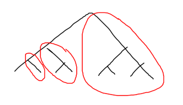

# Lecture

- multi-core processor
	- is it a distributed system? no
	- the whole processor crashes (we cannot have one core working and other one crashed)
- partial failure
	- in a distributed system, the components may fail independently
	- „distribuovaný systém je to tehdy, když můj počítač přestane fungovat, protože se rozbil počítač, o kterém jsem ani nevěděl, že existuje“
- sharing information, taking a common decision
- why do we want/have a distributed system?
	- users are in different places → it is a distributed system by nature
	- better performance, stability (if one server fails, we have another)

## Ordering of Events

- notation
	- set of processes $P=\set{p_1,\dots,p_n}$
	- they communicate through channels (channel from $p_i$ to $p_j$ … $C_{ij}$)
	- event $\# k$ on process $p_i$ … $e_i^k$
		- event changes the state of the process
	- states of the process $\sigma_i^0,\sigma_i^1,\dots$
		- event $e_i^1$ performs the transition from $\sigma^0_i$ to $\sigma_i^1$ on process $p_i$
	- local history $h_i=e^1_i e^2_i e^3_i \dots$
	- global history $H=h_1\cup h_2\cup h_3\dots$
- happened_before ($\to$) relation between two events
	- first case: $e_i^k\to e_i^\ell$ iff $k\lt\ell$
	- second case: send($m$) $\to$ recv($m$)
		- we can receive a message $m$ only after we send it
	- transitivity: $e\to e'\land e'\to e''\implies e\to e''$
	- antisymmetry: $e\to e'\implies e'\not\to e$
	- it is a partial ordering of events
	- if there is no relation between $e$ and $e'$, we say they are concurrent
		- $e||e'$
- global state $(\sigma_1^{k_1},\sigma_2^{k_2},\sigma_3^{k_3},\dots)$
	- global state is composed of the local state of every process
- cut
	- cut $C$ … subset of the global history $H$ that includes a prefix of each local history
	- consistent cut … the global state could have existed
		- cut $C$ is consistent iff $e'\in C\land e\to e'\implies e\in C$
- Chandy-Lamport
	- we assume FIFO channels
	- to save a snapshot, we need an initiator process which is the first to save its state and broadcast the message SNAPSHOT
	- when process $p_i$ receives the SNAPSHOT message, it saves its state and also broadcasts SNAPSHOT (there are no other events in between)
	- the state of channel $c_{ji}$ corresponds to the messages that the process $p_i$ received from $p_j$ between broadcasting SNAPSHOT and receiving SNAPSHOT from $c_j$
	- after $p_i$ receives SNAPSHOT from all processes, it knows that the computation of the snapshot is terminated

## Time

- how to put timestamps on events to have guarantees that one event happened before another event?
	- I would like a timestamp function $TS$ such that $e\to e'\iff TS(e)\lt TS(e')$
	- we are assuming an asynchronous system
		- no bound on message delays
		- no bound on relative speed of processes
- Lamport Clock $LC$
	- algorithm
		- initial state … $LC_i\leftarrow 0$
		- for any internal event … $LC_i\leftarrow LC_i+1$
		- on $\mathrm{send}(m)$ … $LC_i\leftarrow LC_i+1$
			- + attach $LC_i$ to $m$, so that $ts(m)=LC_i(\mathrm{send}(m))$
		- when $p_j$ receives $m$
			- $LC_j\leftarrow\max(LC_j,ts(m))+1$
	- what can we say about LC?
		- $e\to e'\implies LC(e)\lt LC(e')$
			- we don't have $\impliedby$
		- $LC_i(e)$ corresponds to the length of the longest chain of events (longest causal chain) leading to $e$
- vector clocks
	- definition
		- for $i=j:VC(e_i)[j]=$ number of events on $p_i$ up to and including $e_i$
		- for $i\neq j:VC(e_i)[j]=$ number of events on $p_j$ that happened_before $e_i$
	- algorithm
		- if $e_i$ is internal or $\mathrm{send}(m)$
			- $VC(e_i)\leftarrow VC_i$
			- $VC(e_i)[i]\leftarrow VC_i[i]+1$
		- if $e_i$ is $\mathrm{recv}(m)$
			- $VC(e_i)\leftarrow\max(VC_i,ts(m))$
			- $VC(e_i)[i]\leftarrow VC(e_i)[i]+1$
	- how we compare vectors
		- $u\lt v\iff(\forall i)(u_i\leq v_i)\land(\exists j)(u_j\lt v_j)$
	- it holds that $e\to e'\iff VC(e)\lt VC(e')$

## Abstractions, Failure Detectors

- abstractions – we want something simple but useful
	- we use a stack of components, every component has an interface
- fault models for processes
	- crash-stop
		- process crashes and never comes back
		- the most typical model
	- crash-recovery
		- process crashes and later resumes from the point where it crashed
		- but this rarely happens
		- it is more usual to restart the process – reinitialize it (so it's a new process)
		- use case: if a process loses its connection frequently
	- byzantine
		- process doesn't behave according to its specification
		- might happen for various reasons – corrupted memory, attack, …
		- possible strategies
			- we need to guarantee that the process can be trusted
			- we assume that there is a limited number of byzantine process and use majority vote
- fault models for channels
	- integrity
		- “channels don't create messages & channels don't modify/corrupt messages”
		- a link from $p$ to $q$ satisfies integrity if $q$ receives a message $m$ at most once, and only if it was previously sent by $p$
		- note: $m$ can be lost
	- fair link – satisfies integrity & if $p$ sends $m$ infinitely often, then $q$ receives $m$ infinitely often (the channel can lose an infinity of messages)
	- reliable link – satisfies integrity & if $p$ sends $m$ and $q$ is correct (does not crash), then $q$ receives $m$
		- → the channel does not lose messages
		- problem: $p$ could crash right after sending $m$
	- quasi-reliable link – satisfies integrity & if $p$ sends $m$ and $p,q$ are correct, then $q$ receives $m$
		- if $m$ gets lost, $p$ can “send it again”
- why do we define reliable link?
	- it can help us to determine if a problem is solvable or not
	- if we cannot solve the problem using reliable link, there is no way to solve it using weaker fault models
- in reality we only have fair links
	- we can implement stubborn links and then quasi-reliable links
	- then, we want to add a FIFO property on top of that
- implementation
	- stubborn link – if $p$ sends $m$ once (and is correct?), $q$ receives it an infinite number of times
		- does not satisfy integrity (creates messages)
		- we just send all the previously sent messages repeatedly every $\Delta$ time units
		- see [lecture notes](https://tropars.github.io/downloads/lectures/DS/DS-3-failure_detectors.pdf) for the implementation
		- receive vs. deliver
			- in our stack of abstractions, there are several layers: network, fair links, stubborn links, quasi-reliable links, process
			- the layer receives a message and then decides to deliver it
	- quasi-reliable link
		- we keep a set of delivered messages
		- but the set is always growing
		- we could use ACK and then remove the message from the set after $p$ stops sending it
			- but how to correctly detect that $p$ stopped sending?
		- problematic scenario
			- $p$ is sending $m$ repeatedly
			- $q$ sends ACK
			- after some time, $q$ removes $m$ from the delivered set
			- another instance of $m$ arrives to $q$
			- $q$ recognizes $m$ as a new message
		- in practice, we send a sequence number to let the other side know how many messages we already received
			- it can be bundled with messages
			- if there are no new messages in the channel, we may want to send the acknowledgement separately (with its own sequence number)
	- FIFO quasi-reliable link
		- properties
			- satisfies integrity
			- if $p$ sends $m$ and $p,q$ are correct, then $q$ receives $m$
			- if $p$ sends $m'$ after $m$ and $p,q$ are correct, then $q$ receives $m'$ after $m$
		- implementation proposal
			- sender $p$ assigns a timestamp to every message, the messages are then ordered by the timestamp
- synchronous system
	- bound on message delay … $\Delta$
		- the maximum time required to deliver a message
	- bound on process speed … $x\beta$
		- the fastest process needs $x$ time to do something $\implies$ the slowest process needs $x\beta$ time to do this
	- $p_1$ asks $p_2$: “are you alive?”
		- in an asynchronous system, there is no way to tell if the other process is alive
		- in a synchronous system, $p_1$ can be sure that the response has to arrive at most after $2\Delta+x\beta$
	- failure detector
		- a magic box
		- tells the process which other processes are alive
		- two properties: completeness, accuracy
		- by default
			- can make mistakes
			- can change its mind
			- different FDs can have different opinions
		- completeness
			- strong – eventually every crashed process is suspected by every correct process
			- weak – eventually every crashed process is suspected by some correct processes (at least one)
		- accuracy
			- strong – no process is suspected before it crashes
			- weak – some correct processes are never suspected
			- eventually strong – there is a time after which we get the strong accuracy
			- eventually weak – there is a time after which we get the weak accuracy (some correct processes are not suspected)
		- perfect failure detector $(P)$ – strong completeness, strong accuracy
		- eventually perfect failure detector $(\Diamond P)$ – strong completeness + eventually strong accuracy
		- strong failure detector $(S)$ – strong completeness + weak accuracy
		- eventually strong failure detector $(\Diamond S)$ – strong completeness + eventually weak accuracy
	- exam question: is this going to work if we have a strong failure detector?
	- if we have a perfect failure detector, the system is almost synchronous
	- the system can have short periods of instability at some point
		- then it is going to calm down – we want to be able to somehow reliably capture the result

## Reliable Broadcast

- properties
	- safety – nothing bad will ever happen
	- liveness – something good will eventually happen
- we assume crash-stop failure model for processes and quasi-reliable channels
- best-effort broadcast
	- integrity – each process delivers message $m$ at most once and only if it was broadcasted by some process
		- safety property
	- validity – if a correct process broadcasts a message $m$, then every correct process eventually delivers $m$
		- liveness property
	- implementation straightforward using quasi-reliable channels
	- performance metrics
		- number of communication steps required to terminate one operation – one
		- number of messages exchanged during one operation – $O(N)$, where $N$ is the number of processes
	- problem: if a sender crashes, some processes might not get the message
- (regular) reliable broadcast
	- properties: integrity & validity & agreement
	- agreement – if a message $m$ is delivered by some correct process, then $m$ is eventually delivered by every correct process
		- liveness property
	- implementation uses best-effort broadcast and perfect failure detector
	- two rules
		- if a process delivers $m$, whose sender has crashed, it broadcasts $m$ again
		- when $p$ becomes aware that $q$ has crashed, $p$ broadcasts all $q$'s messages that $p$ has already delivered
	- performance
		- best case: one communication step, $O(N)$ messages
		- worst case: $N$ communication steps, $O(N^2)$ messages
	- exercise
		- if we used a failure detector satisfying only weak accuracy, the performance would be worse
		- with only weak completeness, agreement is not ensured
			- the correct process who delivered $m$ might not know that the sender has crashed
		- if we don't wanna rely on the failure detector, we can just broadcast every received (broadcasted) message
	- problematic scenario
		- $m$ is delivered by a process and then it crashes (the sender crashes too)
		- other correct processes don't get $m$
- uniform reliable broadcast
	- properties: integrity & validity & uniform agreement
	- uniform agreement – if a message m is delivered by some process (whether correct or not), then m is eventually delivered by every correct process
	- implementation in [lecture notes](https://tropars.github.io/downloads/lectures/DS/DS-4-bcast.pdf#page=5)
	- the proposed solution is called All-ack Uniform Reliable Broadcast
	- idea – process can deliver a message only when it has received a copy of that message from all correct processes 
		- so every process broadcasts $m$ after receiving it for the first time
		- process also updates its list of correct processes
		- $p$ checks whether $m$ can be delivered every time 1) $p$ it receives $m$, 2) a process crashes
	- performance
		- best case: two communication steps
			1. sender broadcasts … $N$ messages
			2. everyone else broadcasts … $(N-1)\times N$ messages
		- worst case: $N+1$ steps required to terminate (if processes crash in sequence)
		- $N^2$ messages sent
- FIFO reliable broadcast
	- properties: integrity & validity & agreement & FIFO delivery
	- FIFO delivery – if some process broadcasts message $m_1$ before it broadcasts message $m_2$, then no correct process delivers $m_2$ unless it has already delivered $m_1$
	- solution – piggybacking sequence numbers
		- so we just sort the messages (delay some of them)
- how to make it faster?
	- we could make the broadcast circular
	- we could build a binary tree
		- better latency
		- but what if a process crashes?
- *gossip*
	- $k$ … number of processes to contact
	- $r$ … number of rounds to execute
	- for $k=3$, the original process randomly selects 3 processes it sends the message to
		- then, each process sends the message to 3 randomly selected processes
		- after $r$ rounds, the sending stops
	- probabilistic broadcast algorithm – we cannot guarantee that every correct process gets the message
	- efficiency declines over time – we send to processes who have already got the message
		- push strategy – processes who have the information send messages to processes who don't
		- pull strategy – “hey, is there anything I missed?”
			- we can use a vector clock for this

## Consensus

- examples
	- clients & servers
		- all servers should behave the same
		- the servers should agree on the order of processing clients' requests → consensus problem
	- Kafka (who's the leader?)
	- blockchain
- the component should have two functions
	- $\mathrm{propose}(v_i)$
		- $v_i$ … value proposed by process $i$
	- $\mathrm{decide}(v)$
		- all processes should agree on the same $v$ in the end
- properties
	- termination – every correct process should eventually decide
	- validity – if a process decides $v$, then $v$ is the initial (proposed) value of some process
	- uniform agreement – two processes cannot decide differently
		- agreement (two *correct* processes cannot decide differently) would be too weak
- we consider
	- asynchronous system
		- no bound on message delays
		- no bound on relative speed of processes
	- quasi-reliable channels, processes may crash
- if we don't make any additional assumptions, consensus is impossible to ensure
	- FLP impossibility
	- if $F=1$
	- did the process crash or not?
- proof (for a little bit different statement)
	- $N$ … number of processes
	- $F$ … number of crashed processed
	- we allow $F\gt\frac N2$
	- let's make groups $G_0,G_1$
		- $G_0$ contains a little bit more processes than $G_1$
	- run $R_0$
		- all processes in $G_1$ crash
		- all processes in $G_0$ proposed $v=0$
		- so we decide $v=0$ after time $T_0$
	- run $R_1$
		- all processes in $G_0$ crash
		- all processes in $G_1$ propose $v=1$
		- so we decide $v=1$ after time $T_1$
	- run $R_2$
		- no process crashes
		- communication between groups is delayed
		- after time $T_0$, processes in $G_0$ do not have any message from group $G_1$
			- so they need to decide $v=0$ (as in $R_0$)
		- after time $T_1$, processes in $G_1$ do not have any message from group $G_0$
			- so they need to decide $v=1$ (as in $R_1$)
		- no consensus :(
- let's start with a synchronous system!
	- we have a perfect failure detector $P$
	- we are going to use the best-effort broadcast algorithm
	- assuming no crashes
		- everyone broadcasts proposed values
		- after receiving values from everyone, we'll use a deterministic decision function (like $\mathrm{min}$)
- valence of a configuration
	- $\mathrm{val}(c)$ … set of possible values that could be decided (initially – set of proposed values)
	- we want to get from a multivalent configuration to a univalent configuration
		- $v$-valent configuration … $\mathrm{val}(c)=\set{v}$
	- then, we we want the processes to detect we reached that configuration
- algorithm for a synchronous system
	- see [lecture notes](https://tropars.github.io/downloads/lectures/DS/DS-5-consensus.pdf#page=4)
	- several rounds
	- for a round to end, we need to get messages from all the correct processes
	- after two consecutive rounds with the same correct processes (no one crashes), we can decide
	- in every broadcast, we send the values we have collected so far
		- to ensure that everyone has the same information
	- this algorithm does not provide uniform agreement
- how to get uniform agreement?
	- we can do $f+1$ rounds where $f$ is the number of processes that can crash
		- 3 rounds without crash would probably also work
- partially synchronous system
	- $\Delta$ bound on transition delay and $\beta$ bound on how slow the process can be
		- both hold eventually
		- there is a time $T$ (unknown) after which bounds $\beta,\Delta$ will hold forever
	- $T$ … GST (global stabilization time)
		- channels can lose messages before GST
		- channels are quasi-reliable after GST
	- GSR (global stabilization round) = first round when the system behaves as synchronous
		- $\exists GSR\gt 0$ s.t. $\forall r\gt GSR,\forall p,q$ correct $(p$ sends $m$ to $q$ in round $r\implies q$ recv $m$ in round $r)$
	- we don't use a failure detector here
	- OneThirdRule algorithm
		- assumption $f\lt \frac n3$
		- at the start of each round, the process $p$ sends value $x_p$ to all processes
		- as the process receives messages in the given round
			- if it gets more at least $n-f$ messages, it sets $x_p$ to the most frequent value received (take the smallest if there are multiple with the same greatest frequency)
			- if at least $n-f$ values received are equal to a value $v$, it decides $v$
		- we transition between rounds after predefined time
			- after GSR, we can guarantee that there is enough time to get all the messages
	- example
		- 1 process decides $v$ in round $r_0$
		- → $n-f$ times $v$ received
		- → $n-f$ processes proposed $v$
		- → there cannot exist another $n-f$ processes proposing $v'$
			- as $(n-f)+(n-f)\gt n$
	- proof by contradiction
		- round $r_1$ … smallest round in which a process $q$ changes its value
		- $q$ received at most $f$ messages with value $\neq v$
		- $q$ received at most $f$ messages with value $v'$
		- … (see lecture notes)
	- idea: you cannot create a different majority
- (broken) consensus algorithms that don't satisfy one of the criteria
	- only validity & uniform agrement – we don't need to do anything
	- only uniform agreement & termination – decide “1”
	- only validity & termination – everyone decides their own proposed value
- Floodset algorithm
	- $W_p=\set{v_p}$ … everyone starts with a value
	- in round $r$
		- send $W_p$
		- on recv $W_q:W_p=W_p\cup W_q$
		- at round $f+1:$ decide $\min W_p$
- does Floodset satisfy uniform agreement?
	- there exists one round when no process crashes
	- $\implies$ everyone not crashed has the same $W_p$
	- if we used round $f$ instead, it would not satisfy uniform agreement (counterexample: one crash every round – there could be a process $p$ having a different $W_p$ than the other processes)

### In Practice

- older algorithms – before distributed systems, based on mathematical models, very complex (implementations actually quite close to Raft)
	- Paxos – consensus on one value
	- MultiPaxos
- Raft 2015
	- used in MongoDB, Kubernetes
	- clients, multiple servers
	- one server is a leader, the other are followers
	- clients send requests to the leader server
	- leader has a log of values received by the clients, periodically sends updates to everyone
	- if no one crashes, it is correct
	- if the leader crashes
		- some followers may have different state than the other ones → inconsistency
		- if the leader performs some external actions and crashes before delivering all the values to all the follower, we lose uniform agreement
		- note: if the leader receives a value and crashes without doing anything else, it's alright (every system has this property)
	- leader sends ACK to the client after $f+1$ processes (the leader & $f$ followers) successfully received the value
	- usually, $n=2f+1$
	- it's based on timeouts
		- there is an empty packet exchange if there are no changes to propagate
		- if there is a period when the timeouts are exceeded, the system can recover
		- usual timeout – 150 ms (the local latency in datacenters is under 1 ms)
	- what happens if the leader crashes
		- the followers don't receive the periodic message (heartbeat) from the leader → they now the leader crashed
		- every follower has a timer, after this time the follower broadcasts “I'm the leader”
			- if it receives enough ACKs from the other processes (majority = $f+1$ including myself), it becomes the new leader
		- what if there are two proposed leaders?
			- if one gets the majority → it becomes the leader (and broadcasts its leadership – we assume honesty)
			- no one gets the majority → another round
	- another approach
		- everyone pings everyone – so everyone has a list of alive processes
		- if the leader fails, the machine with the lowest ID becomes the new leader
		- but this requires sending more traffic over the network
	- in iCloud and similar storages
		- 3 servers, than tape storage (or something like that)
- leader change procedure
	- the logs may only differ in the latest value(s)
	- some processes may have more values than the newly elected leader
	- leader retrieves the values from everyone (in some types of systems) and then propagates the new values to everyone
	- were the new values acknowledged?
		- we don't know
		- there is no good approach to address this
		- they are probably not ACKed (again)
	- in Raft: message, then ACK, then commit message
		- so we know the state of the data (if the data is committed or not)
- recovery
	- if $f+1$ server are in the error state, game over
	- if a server reconnects to the system
		- if it's been offline for a short period of time, it downloads the new values
		- if it's been offline for longer (or it's a new server), it downloads the *snapshot* and the values
	- recovery process is very intense – the servers must be ready for it
		- some companies run the servers on 10% load
- main problem – timers
- reminder – Raft, goal: achieve consensus, crash-stop model
- OneThirdRule algorithm – exercises
	- example of univalent configuration – everyone starts with the same value (or everyone but one process…)
	- if more than $f$ processes crash, termination is broken
## Byzantine

- example: when broadcasting, the process sends its value to a subset of the processes
	- it can be the fault of the network or of the process
	- whose fault is this?
		- the process who did not receive the message thinks the sender is faulty
		- other processes think the receiver is faulty
- so the byzantine process (node)…
	- can send the value or not
	- can equivocate (send different values to different processes)
- byzantine processes can do whatever they want
- we consider the byzantine processes as faulty
	- so we assume there are up to $f$ byzantine processes
	- using OTR (OneThirdRule), can 2 correct processes decide two different values?
		- no, byzantine processes can only achieve *non termination* of some or all nodes
	- can byzantine processes create a network partition?
		- yes, byzantine processes can make some nodes terminate and some not
		- this may cause a problem – if some processes think the payment has been made and some think it has not
- undetectable bitflips happen cca every 10–20 PB of data transmitted over the network
- Raft is not tolerant to byzantine fault model (consider byzantine leader)
- we won't have (strong) termination in byzantine model
- we'll consider weak termination
	- leader is honest → everyone terminates & decides the value of the leader
	- leader is malicious → every honest node decides the same value OR no one decides
- we consider leader-based (broadcast) approaches here
- numbers of processes required to tolerate faults
	- consensus … $n\geq 2f+1$
	- byzantine … $n\geq 3f+1$
- proof
	- $t$ … threshold of messages before making a decision
	- $n=d+h$ (nodes = dishonest + honest)
	- we know $t\leq h$, because $d$ nodes may never send their values
	- $d$ dishonest nodes may try to split the honest nodes in 2
		- every honest node receives $d+\frac h2$ times the same value
		- clearly $t\gt d+\frac h2$
	- we get $h\geq t\gt d+\frac h2$
		- $h\gt d+\frac h2$
		- $d\lt\frac h2$
		- $2d\lt n-d$
		- $n\gt 3d$
	- so $n\geq 3f+1$ to tolerate byzantine processes
- byzantine-tolerant algorithm: Bracha '89
	- requires eventual synchrony
	- assumes $n\geq 3f+1$
	- broadcast algorithm – leader broadcasts and everyone decides
	- algorithm
		- leader
			- broadcasts value to all (or not – if byzantine)
		- all nodes
			- when receive $v$ from leader
				- broadcast `<Echo,v>`
			- when receive `<Echo,v>` from $n-f$ distinct nodes
				- broadcast `<Vote,v>`
				- here, we would usually decide (but we cannot as some processes may get stuck without deciding → we need to tell them!)
			- when receive `<Vote,v>` from $f+1$ distinct nodes
				- broadcast `<Vote,v>`
				- if a process receives $f+1$ votes, it means that there is at least one honest process willing to decide
			- when receive `<Vote,v>` from $n-f$ distinct
				- decide $v$
	- two parts – OTR and voting phase
- many years later: PBFT (practical byzantine fault tolerance)
	- the code had many bugs
	- until ~2010 no correct implementation of byzantine fault tolerant system
- in practice, leader sends signed values → we know who misbehaved
- issue of the byzantine-tolerant algorithm
	- there's no incentive for the node to follow the protocol (if it misbehaves, nothing happens to the node)

## Blockchain

- B-tree
	- B usually equal to the size of a cache line
- Merkle tree
	- similar structure to a B-tree
	- every node has a hash
		- hash of a node is the hash of its content + the sum of hashes of its children
		- (hash of a leaf is the hash of its content)
		- hash … SHA-512
	- hash of the root is “unique” per tree
		- if hashes of roots of two trees equal, the two trees are equal with a high probability
- blockchain state for Bitcoin
	- pairs: account (hash/wallet) → number of BTC
	- stored in Merkle tree
	- we can compare the hash of the root to see if everyone agrees on the tree
- example (Bitcoin)
	- as a client, I want to send amount $Y$ to an account $X$
	- this message is signed and broadcasted to all the nodes (clients)
	- some clients are “miners”, they try to create blocks
		- their goal is to add a block in the blockchain
		- in a block, there is…
			- time
			- hash of the root before transactions
			- list of transactions
			- hash of the root after applying transactions
			- challenge
		- to append a block to the chain, the “hash before” of the new block must be equal to the ”hash after” of the last block
		- then, there's a challenge
			- ”find a number $R$ such that the hash $h(h_\mathrm{before}+h_\mathrm{after}+h_\mathrm{mywallet}+R)$ starts with a certain number of zeros“
		- there should be 1 block every 10 minutes
			- if the challenge is too hard, the difficulty is decreased (by reducing the number of zeros?)
			- clocks need to be synchronized (to some extent)
	- what if two miners propose solution at the same time?
		- longest chain is chosen
		- rule of thumb: wait for 6 blocks before being sure the transaction is in the system
	- as a new client
		- you first download the whole chain
		- you check it's correct
		- from that moment, you receive new blocks, you integrate them in the chain
		- if there's a fork, you assume that both are correct
			- you resolve the problem when one side gets longer (delete the shorter chain)
			- if you receive a block you cannot integrate in the chain (e.g. you already deleted this part of the fork), you ask for all the missing blocks
	- problems
		- you can have forks
		- you can flood the protocol
		- latency
	- advantage
		- working non stop since 2004
	- as a miner, you can assign yourself a reward in the block
	- challenge … compute many hashes
		- the higher the reward for the block, the more electricity is used
- Ethereum
	- proof of stake
	- a miner sends a transaction to the network saying “I want to mine”
	- then, the network says ”it's your turn” periodically
	- if the miner misbehaves, the network confiscates the miner's money
	- rounds are 6 minutes long
	- choosing the next miner
		- first round: miner broadcasts hash of a secret + stake
			- and receives back many hashes (of the other secrets)
		- second round: miner broadcasts the secret
			- and receives all the secrets from other miners
		- the next miner is chosen using a function of all the secrets
	- if a node misbehaves, people confiscate its money (at stake)
		- all the messages are signed so we can prove that a node misbehaved
	- in the system, there are validators
		- if you detect the problem, you can send send an alarm and confiscate some coins
	- Bracha broadcasting algorithm is used
	- Ethereum is Turing-complete
		- you can store code in the state
		- there are smart contracts, e.g. ”if I receive money from two people, I send money to a third person”
	- you need to pay a fee to execute a transaction … gas
		- this is voluntary in Bitcoin (but will be mandatory after all the coins are mined)
	- there are no forks in Ethereum, the system is byzantine-tolerant

## Distributed Hash Tables

- implementation – [Kademlia](https://pdos.csail.mit.edu/~petar/papers/maymounkov-kademlia-lncs.pdf) 2003
	- used by Bittorrent, Ethereum, (Bitcoin)
- every node has an ID
	- computed by hashing a random number
	- 160 bits
- every node should
	- have a fine-grained knowledge of all the nodes that are close (that have small distance)
	- have a coarse knowledge of nodes farther away
- distance is defined as XOR of IDs
- so if node gets some work which should be done by another node, they can send it in the correct direction (even if they don't know the node)
- every node maintains a tree of other nodes ordered by distance
	- the tree should not be too big
	- → we group the nodes in the “right” branches into buckets
		- 
	- maximum of $k$ nodes per bucket
	- = $k$-bucket tree
	- so we store $k$ far-away nodes, $k$ nodes that are a bit closer, $k$ much closer nodes, $\leq k$ very close nodes, and all the neighbors
	- in the buckets, we keep nodes that have been alive for long time (to minimize likelihood that they disappear)
- the client wants to store value for a certain key
	- we compute a hash from the key
	- we let $k$ machines closest to the hash to be responsible for storing the value
		- this $k$ can be different from the previous $k$ but is (probably) the same in practice
- another task: I delegate the work to a node of the bucket closest to the key (or its hash)
	- it takes $\log N$ hops to get to the closest node
- hashtable operations
	- find_value(hash) → value
		- if I am responsible, I answer
		- otherwise, I answer with find_nodes(hash)
	- find_nodes(hash) → nodes
		- send bucket closest to hash
	- store_value(hash, value)
	- ping(node) → alive?
- connecting to the network
	- you generate your own hash
	- bootstrapping
		- you have a hardcoded list of peers who participate
		- you send them a query find_nodes(myself)

## Modern Consensus

- TCP/UDP
	- `write` syscall copies data into kernel buffer and sends them
	- similarly, data is read from the kernel buffer (the app needs to be waken up after receiving the data)
	- it's very slow
- modern network
	- 400 Gbps, 400 millions I/O per second
		- CPU cannot do enough reads to support that
	- RDMA
		- client app performs rdma alloc, gets its own buffer
		- server app also performs rdma alloc, gets buffer
		- memory is then copied over network directly from one buffer to another
			- it is performed by network card
			- that way, it's easier to implement Raft (the entire log can be in the memory accessible by the network card)
		- downside: you can corrupt someone else's memory
- exam
	- 1 A4 of written notes (both sides)
	- nothing taught by Baptiste Lepers
