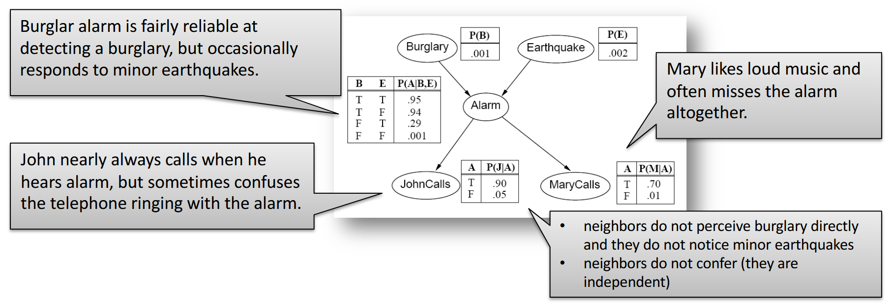

# Zkouška

## Introduction, Probability

- rational agent
	- agent – perceives environment through sensors, acts upon environment through actuators
	- rational agent maximizes its expected performance measure
	- in AI 1 we used logical approach; we ignored uncertainty
		- including interface between agent and environment
		- we also ignored self-improvement capabilities
- uncertainty in pure logical approach
	- belief states
		- instead of having *state*, we have a belief state (set of all possibilities that can be true)
	- drawbacks
		- logical agent must consider every logically possible explanation for the observations (no matter how unlikely they are) → large and complex representations
		- we need to consider arbitrary likely events – have a plan for any situation no matter how unlikely it is
		- sometimes there's no plan which would guarantee the desired result (but the agent still has to act somehow)
	- practical problems (in medicine)
		- laziness – it is too much work to list the complete set of antecedents or consequents and too hard to use such rules
		- theoretical ignorance – medical science has no complete theory for the domain
		- practical ignorance – even if we know all the rules, we may not be able run all the necessary tests
	- that's why we'll use another approach – probability theory
- probability
	- sample space = set of possible worlds $\Omega$
		- $\forall\omega\in\Omega: 0\leq P(\omega)\leq 1$
		- $\sum_{\omega\in\Omega} P(\omega)=1$
	- probability of event = sum of probabilities of possible worlds where the event occurs
		- = unconditional/prior probabilities (priors)
	- conditional/posterior probability
		- $P(a\mid b)=\frac{P(a\land b)}{P(b)}$ whenever $P(b)\gt 0$
		- we take some information (evidence) into account
	- in a factored representation, a possible world is represented by a set of variable/value pairs
		- every variable has a domain
		- a possible world is fully identified by values of all random variables
	- probability of all possible worlds can be represented using a table called a *full joint probability distribution*
	- $\textbf{P}(\mathrm{Cavity})=\braket{0.2,0.8}$
		- Cavity = true → 0.2
		- Cavity = false → 0.8
	- inclusion-exclusion principle
		- $P(a\lor b)=P(a)+P(b)-P(a\land b)$
- practicality of full joint probability distribution
	- we can do inference by summing up certain cells of the full joint distribution table (= marginalization)
	- using normalization constant $\alpha$ may be helpful
	- drawbacks of inference by enumeration
		- worst-case complexity $O(d^n)$ where $d$ is number of values in domains of each variable
		- we need the same space to store the full joint distribution
	- adding another variable – weather
		- does not influence tooth problems (is independent) → we add another table
		- we can represent the resulting joint distribution using two tables
		- conditional independence can be exploited to further reduce the size of representation (instead of one large table, we use several smaller tables)
	- also, we don't need to store the entire table (probabilities add up to one)
- usually, we are interested in the diagnostic direction P(disease | symptoms)
	- but we know P(disease), P(symptoms), and P(symptoms | disease) … causal direction
	- we use Bayes' rule to get the diagnostic direction
	- it may be better not to store the diagnostic direction as the original probabilities (we base the calculation upon) may change
- Bayes’ rule
	- $P(Y\mid X)=\frac{P(X\mid Y)P(Y)}{P(X)}=\alpha P(X\mid Y)P(Y)$
	- or $P(B_j\mid A)=\frac{P(A\mid B_j)P(B_j)}{\sum_i P(A\mid B_i)P(B_i)}=\alpha P(A\mid B_j)P(B_j)$
- naive Bayes model
	- generally, we can exploit conditional independence by ordering the variables properly
	- naive Bayes model – we *assume* independence
		- $P(\text{Cause}, \text{Effect}_1, \dots, \text{Effect}_n) = P(\text{Cause})\prod_iP(\text{Effect}_i\mid\text{Cause})$

## Bayesian Networks

- Bayesian network
	- DAG; specifies conditional dependence among random variables
	- an efficient way to represent full joint probability distribution by exploiting conditional independence
	- nodes correspond to random variables, arcs describe the dependencies
	- CPT (conditional probability table) for each variable
		- to get full joint distribution, we just multiply the tables
	- 
		- autorem obrázku je [Roman Barták](https://ktiml.mff.cuni.cz/~bartak/ui_intro/)
		- proměnné jsou binární, proto má tabulka vždy jen jeden sloupec (druhý sloupec by mohl obsahovat pravděpodobnost, že jev nenastane – lze ho dopočítat z prvního sloupce)
- construction
	- we construct the network based on the selected order
	- usually, we want to use the causal direction (so that we know how to construct the CPTs; also the network will be smaller)
	- the arc should be there if there is a dependence between the variables
		- for $X$ independent on $Y$, it should hold that $P(X\mid Y,Z)=P(X\mid \neg Y,Z)=P(X\mid Z)$
	- příklad: MaryCalls, JohnCalls, Alarm, Burglary, Earthquake (záměrně jdeme od důsledků k příčinám, byť to není praktické)
		- z MaryCalls povede hrana do JohnCalls, protože nejsou nezávislé (když volá Mary, tak je větší šance, že volá i John)
		- z obou povede hrana do Alarmu
		- z Alarmu vedou hrany do Burglary a Earthquake (ale hrany z JohnCalls a MarryCalls tam nepovedou – na těch hranách nezáleží, jsou nezávislé)
		- z Burglary povede hrana do Earthquake, protože pokud zní alarm a k vloupání nedošlo, tak pravděpodobně došlo k zemětřesení
		- akorát se nám v tomto pořadí budou špatně určovat CPT
- how much space can we save?
	- random variables are often influenced by only a few other variables
	- assume that each variable is directly influenced by at most $k$ other variables
	- then the size of representation is $n\cdot 2^k$ for Bayesian network vs. $2^n$ for full joint distribution
	- we can also ignore some slight dependencies – trade-off between accuracy and size of the network
	- we need to choose the correct ordering of variables
- conditional independence in Bayesian networks
	- node is conditionally independent of its non-descendants given its parents
	- node is conditionally independent of all other nodes given its *parents, children, and children's parents*
		- *Markov blanket* = parents, children, children's parents
		- M. blanket contains all the information needed to infer the value of the variable (other variables are redundant)
- exact inference (by enumeration)
	- using joint probability (we sum over hidden variables) + moving terms out of the sums if possible
		- $P(X\mid e)=\alpha P(X,e)=\alpha\sum_y P(X,e,y)$
		- kde pravděpodobnost $X$ odvozujeme, $e$ jsou pozorované proměnné (evidence) a $y$ jsou hodnoty další skryté proměnné $Y$
		- přičemž $P(X,e,y)$ lze určit pomocí CPD tabulek
			- když nemůžeme určit konkrétní hodnotu pravděpodobnosti přímo, tak výpočet rozvětvíme
			- některé větve se objeví vícekrát – hodí se nám dynamické programování
		- příklad: $P(b\mid j,m)=\alpha\sum_e\sum_a P(b)P(e)P(a\mid b,e)P(j\mid a)P(m\mid a)$
			- $=\alpha P(b)\sum_e P(e)\sum_a P(a\mid b,e) P(j\mid a)P(m\mid a)$
			- tohle můžeme přímo převést na výpočty s *faktory*
	- we can use factors (tables constructed from CPTs)
		- multiplication: we can (pointwise) multiply the rows that have the same values of the shared variables
		- elimination: we sum the rows that are almost the same (differ only in the value of the variable we want to eliminate)
		- we construct the factors based on the evidence
		- suggested ordering – eliminate the variables that would need large factors in the subsequent stages
	- complexity
		- given by the size of the largest factor constructed
			- heuristic: eliminate whichever variable minimizes the size of the next factor to be constructed
		- if Bayesian network is a polytree (corresponding undirected graph is a tree), then the time and space complexity is linear in the size of the network
			- size of the network = number of CPT entries … $O(nd^k)$
		- 3SAT can be reduced to inference in the Bayesian networks so inference in Bayesian networks is NP-hard
		- the problem is \#P-hard (“number of satisfying assignments for a prop. logic formula”)
- approximate inference
	- *Monte Carlo methods*
	- direct sampling
		- we are going through the Bayesian network in top-down order
		- in each step, we sample one variable and then base further sampling on this choice
		- this only provides us with the samples (but we want to infer the probabilities!)
	- rejection sampling
		- we generate samples using direct sampling
		- we eliminate the ones that don't correspond to the evidence
		- we estimate $P(X\mid e)$ as the number of correct (not eliminated) samples divided by the number of all samples
		- problem: we may reject too many samples
	- likelihood weighting
		- instead of rejecting samples, we generate only the ones consistent with evidence $e$
		- but then, we lose information about the probability of the specific piece of evidence (which may be dependent on the generated hidden variables)
		- so we assign weights to the samples according to the probability of the evidence
		- our arithmetic has to be precise enough
	- MCMC (Markov chain Monte Carlo)
		- start with randomly generated sample consistent with evidence $e$
		- for a selected variable $X$ (outside evidence), select a new value conditioned on the values of the variables in the Markov blanket
		- we get a Markov chain
		- *Gibbs sampling*
		- sampling process settles into a dynamic equilibrium in which the long-term fraction of time spent in each state is exactly proportional to its posterior probability
		- why it works
			- for stationary distribution we require $\pi(x')=\sum_x \pi(x) q(x\to x')$
			- this holds when $\pi(x) q(x\to x')=\pi(x')q(x'\to x)$ … can be shown
				- $\pi(x)=P(x\mid e)=P(x_i,y_i\mid e)$
				- $q(x\to x')=P(x_i'\mid y_i,e)=P(x_i'\mid mb(X_i))$

## Partial Observability

- partially observable environment with discrete time
	- structure of the model is similar to the Bayesian network
	- hidden variables $X_t$, observable variables $E_t$
	- states are evolving according to some rules → transition model
	- Markov assumption: $X_t$ depends on a fixed number of previous states (usually one)
		- $P(X_t\mid X_{0:t-1})=P(X_t\mid X_{t-1})$
		- → first-order Markov chain
			- in a second-order MC, $X_t$ depends on both $X_{t-1}$ and $X_{t-2}$
	- another assumption: the process is stationary
		- transition probabilities are always the same (independent on $t$)
	- sensor Markov assumption: $E_t$ depends only on $X_t$
		- but there are sensors where this does not hold (e.g. liquid-based thermometer)
		- personal note: for proprioceptive sensors, $E_t$ depends on $X_t$ and $X_{t-1}$
	- first-order Markov assumption: the state variables contain all the information needed to characterize the next time slice (its distribution)
		- what if it does not hold?
		- increase the order of the Markov process model
		- or enlarge the set of state variables
		- note: increasing the order can be reformulated as an increase in set of state variables
	- reasoning in this Bayesian network
		- can be done but is not efficient (too many time steps)
	- basic inference tasks: filtering, prediction, smoothing, most likely explanation
		- these tasks can be performed efficiently without a Bayesian network
		- filtering
			- we want to have a recursive estimation – estimate the current distribution based on the observation and previous distribution
		- prediction
			- idea: perform filtering, then use the transition model
			- after some time (mixing time) the distribution converges to the stationary distribution of the Markov process and remains constant
		- smoothing
			- we use both filtering (forward message passing) and backward message passing
		- most likely explanation/sequence
			- we could do smoothing for every time slice and select the most probable state at the given time
				- but this might lead to a sequence with very low probability (e.g. if there are two states with low transition probability)
			- again, forward message passing algorithm
			- we don't need to normalize if we only want the maximum (but the numbers get smaller)
			- Viterbi algorithm
	- hidden Markov models
		- single discrete random variable & single evidence variable → it's a hidden Markov model
		- we can use matrix implementation of all the basic algorithms
		- full smoothing
			- we don't need to run smoothing $t$ times in order to smooth the whole sequence
			- we can use dynamic programming (store the forward/backward values) – but we need more memory then
				- we need to store the whole sequence of forward distributions
			- idea: remember only the current forward distribution, apply operation to get the previous one
				- we can exploit matrix multiplication – use the inverse matrices $(T^T)^{-1},O^{-1}$ if possible (for the $O$ matrix it's always possible as it's a diagonal matrix)
		- smoothing with a fixed time lag
			- $P(X_{t-d}\mid e_{1:t})$
			- forward: simple
			- backward: keep the multiplied matrix without multiplying by the vector $b$
				- then the product of matrices can be modified incrementally
- dynamic Bayesian networks, Kalman filter
	- …

## Utility theory

- utility function $U(s)$
- rational agent maximizes its expected utility
- rational preferences
- often there is uncertainty about what is really being offered
	- every possible outcome has a probability
	- “lottery”
- rational preferences should obey certain constraints
	- orderability
	- transitivity (violating it can lead to irrational behavior)
	- continuity
	- substitutability
	- monotonicity
	- decomposability
- normalized utility function $\in[0,1]$
	- how can we assign it?
	- trick with a lottery (with $1-p$ you get the worst output, with $p$ you get the best output)
- utility of money
- human judgment
	- Allais paradox
	- certainty effect
		- nedá se to popsat jako dvě funkce (expected money, risk), z nichž jedna dominuje?
	- Ellsberg paradox
	- ambiguity aversion
	- framing effect
	- anchoring effect
- multi-attribute utility theory
	- sometimes we can use *dominance* to select the best outcome without combining the attribute values
		- strict dominance
		- can be used even for uncertained outcomes (instead of individual points, we consider some areas)
		- stochastic dominance
- preference structure
	- preference independence
	- mutually utility independent
- the value of information (quantitative)
	- “what questions to ask?”
	- value of perfect information (VPI)
		- properties
	- information gathering – how should rational agent proceed
- qualitative value of information
	- information is beneficial if it changes my action
	- how much do I gain by changing my action?

## Sequential decision problems

- how to set the utility
	- goal exit: +1
	- unwanted exit: -1
	- other states: -0.04 (to find the shortest path to the goal)
- optimal policies
	- do not depend on the initial state
	- the policy is driven by the current state and the goal
- we can first assign long-term utilities to states
	- it's not sufficient to select using argmax, we need to take stochasticity of the actions into account
- POMDP
	- belief state = probability distribution (before, it was just a set of possible states)
	- POMDP can be reduced to a continuous-space MDP
	- value iteration can be modified for POMDPs but it's not very efficient
	- dynamic Bayesian networks and look-ahead techniques are more efficient
		- *expected minimax* algorithm

## Game theory, mechanism design

- …

## Supervised learning

- hypotheses consistent with the training set
- Ockham's razor
	- sometimes, we may even prefer a simple hypothesis that does not perfectly fit all the data
- decision trees
	- for binary variables … $2^n$ possible input vectors, each can be mapped to 0 or 1
		- so we get $2^{2^n}$ hypotheses
	- constructed using a greedy divide-and-conquer strategy
	- if we have no remaining attributes and there are still multiple classes, we return the *mode* (majority vote, česky modus)
	- if there are no samples in the branch of the tree, we use the default value (class) = mode at the previous level
	- to find the best splitting attribute, we use information gain (decrease of Shannon entropy)
		- we subtract the weighted average of new entropies (in the branches) from the original entropy
	- chance of overfitting increases with the number of hypotheses
	- decision tree pruning
		- bottom-up approach, $\chi^2$ test
			- can it be used when constructing the decision tree as an early-stopping condition?
			- no, there are cases where we need a combination of attributes to classify (e.g. XOR) but individual attributes would fail $\chi^2$
	- problems
		- missing data
			- usually, we use the most frequent value (mode) to fill the missing one
		- multivalued attributes
			- (traditionally, we consider nominal attributes with several possible values – what if we have integers or real numbers?)
			- find a threshold
			- for real values, we may want to sort the samples and look at the points where the class changes
	- can be used for regression
		- but the learning algorithm needs to move from classification to regression at some point (usually, we consider only constants in leaves)
- regression
	- hypothesis space = linear functions
	- univariate linear regression
		- $L_2$ loss
		- we can use an analytical solution – set derivatives equal to zero
		- or we can use gradient descent (works even if the hypotheses are non-linear)
- linear classifiers
	- linear separator
	- perceptron learning rule
	- logistic threshold function
- non-parametric models
	- $k$-nearest neighbors
		- majority vote
		- ($k$ should be odd)
		- we need to measure distance – usually $L_p$ norm (Minkowski distance)
			- Manhattan distance, Euclidean distance
			- special case: for boolean attribute values, we have Hamming distance (number of attributes where the data points differ)
			- we have to be careful about the scale, it's common to apply normalization for the individual attributes (to zero mean, unit variance)
		- the curse of dimensionality
			- in low-dimensional spaces with plenty of data, nearest neighbors work well
			- as the number of dimension rises, the nearest neighbors may actually be quite far away
			- with more dimensions, we need more data
		- looking for neighbors
			- table lookup… $O(N)$
			- binary tree … $O(\log N)$
			- hash table … $O(1)$
				- we need the hash function to have some special property
	- regression: simple approaches
		- we get a piece-wise linear function if we connect all the known points
		- 3-nearest neighbors average
		- 3-nearest neighbors linear regression (we fit a model to the three points closest to our input)
		- locally weighted regression – data points are weighted by their distance
	- support vector machines (SVM)
		- three properties
			- maximum margin separator
				- provides good generalization
				- can be found using quadratic programming
				- is defined by the points closest to the boundary
			- kernel trick (solves the problem of the data not being linearly separable)
				- we map the data points to a higher-dimensional space where they are linearly separable
			- it is nonparametric
- ensemble learning
	- we are using multiple hypotheses to perform predictions (they vote)
	- boosting
		- $k$ rounds
		- in every round we generate a hypothesis based on the data, then we increase weights of the misclassified samples (and decrease points of the correctly classified ones)
		- the following hypotheses are generated based on the weighted data
		- even if the underlying algorithm is weak, we can get quite a good classifier
		- AdaBoost algorithm

### Logical formulation of learning

- current-best-hypothesis
	- we start with a simple hypothesis (formula $C(x):=\mathrm{True}$; or we could probably use False)
	- we iterate over the data points and maintain a hypothesis that is consistent with them
		- we may need to generalize or specialize the hypothesis
		- when generalizing, we prefer removing an item from a conjunction over adding a disjunction – we want to keep the hypothesis as simple as possible (according to Ockham's razor principle)
	- after each modification of the hypothesis, we need to check all the previous examples
		- we may need to backtrack
		- problem: strong commitment
- alternative approach: least-commitment search (version space learning)
	- version space learning algorithm / candidate elimination algorithm
	- note that if there are two samples with the same attributes but different classes, our version space collapses
		- it may happen due to noise or if some important attribute is missing from the data
		- representation of version space using a lower bound and an upper bound
- inductive logic programming
	- examples are given like Prolog facts
	- classifications are given by Prolog facts
	- we have some background knowledge (in the form of a formula)
	- we want to learn some hypothesis
	- top-down learning
		- we start with an empty clause
		- we add literals to the body one at a time
		- system FOIL – it was able to learn quicksort
	- inverse resolution